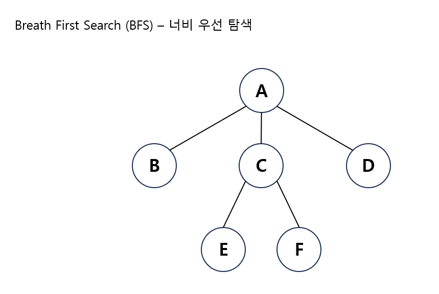
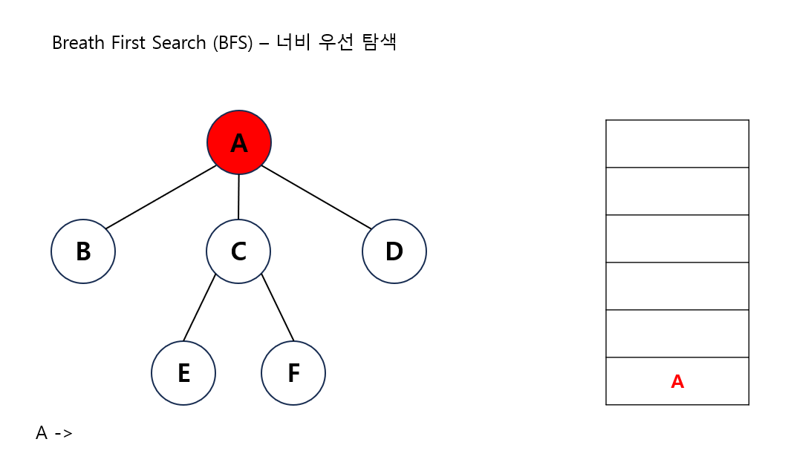
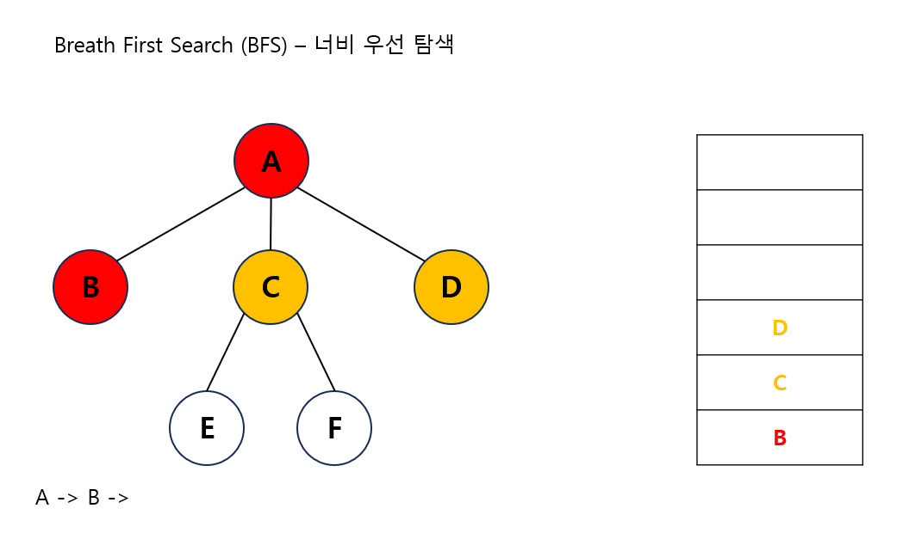
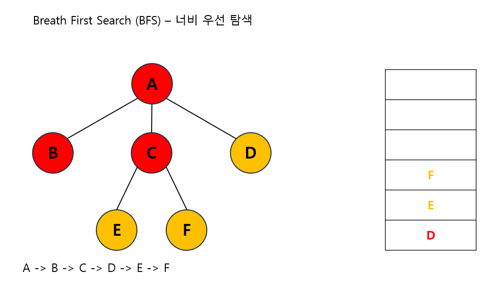

---
layout: simple
title: "BFS"
---

## 너비 우선 탐색
- 시작 정점을 방문한 후 시작 정점에 인접한 모든 정점들을 우선 방문하는 방법입니다.
#### 
- 더 이상 방문하지 않은 정점이 없을 때까지 방문하지 않은 모든 정점들에 대해서도 너비 우선 탐색을 적용합니다.
1. 큐에 A노드를 넣습니다.
#### 
2. 큐에서 A노드를 빼고 A노드와 연결된 노드들을 큐에 넣습니다.
#### 
3. 위 과정을 큐가 빌때까지 반복합니다.
#### 

---

```csharp
public void BFS(int root)
{
    queue.Enqueue(root);
    visited[root] = true;
    while (queue.Count > 0)
    {
        int cur = queue.Dequeue();
        Console.Write(cur + " ");
        
        for (int i = 0; i < list[cur].Count; i++)
        {
            if (visited[list[cur][i]] == false)
            {
                queue.Enqueue(list[cur][i]);
                visited[list[cur][i]] = true;
            }
        }
    }
}
```
