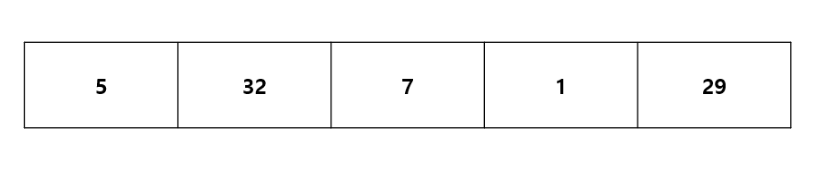
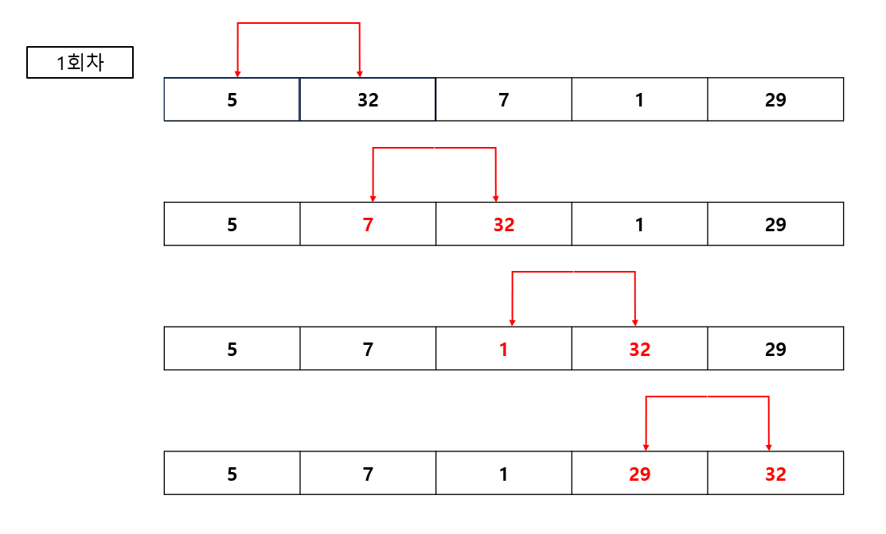
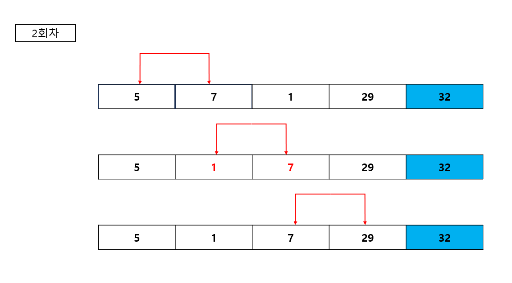
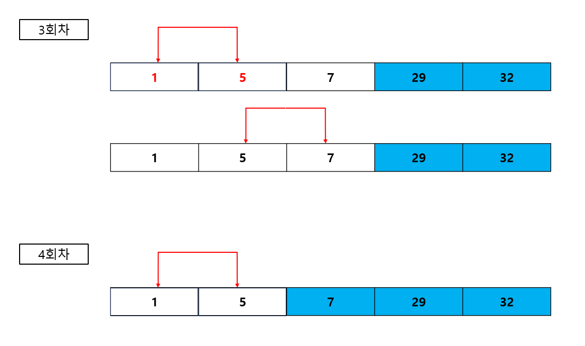

## 버블 정렬
- 서로 인접한 두 원소를 검사하여 정렬하는 알고리즘 입니다.

- 최초 정렬되지 않은 숫자배열



- 숫자 2개를 서로 비교하여 큰 숫자를 뒤로 배치합니다.
- 각 회전 이후 가장 큰 숫자가 해당 회전의 마지막 인덱스에 위치하게 됩니다.





```csharp
int[] bubble = new int[] { 5, 32, 7, 1, 29 };

            int size = bubble.Length - 1;

for (int i = 0; i < size; i++)
{
    for (int j = 0; j < size - i; j++)
    {
        if (bubble[j] > bubble[j + 1])
        {
            int temp = bubble[j];
            bubble[j] = bubble[j + 1];
            bubble[j + 1] = temp;
        }
    }
    
}

            

```