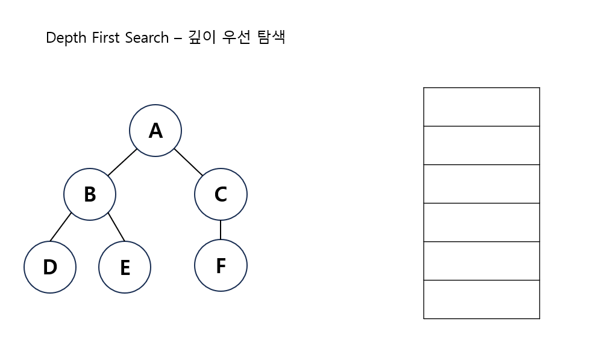
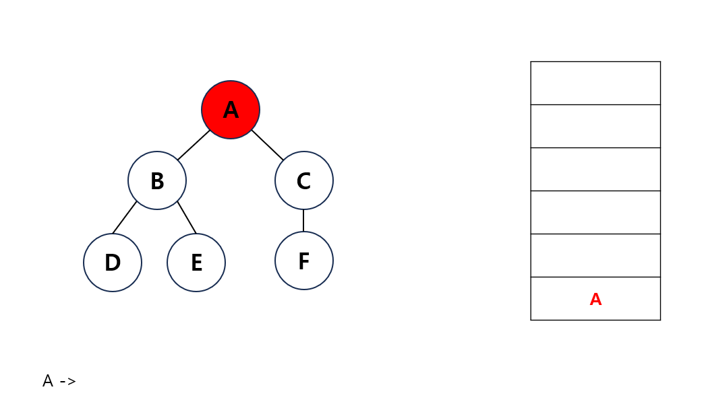
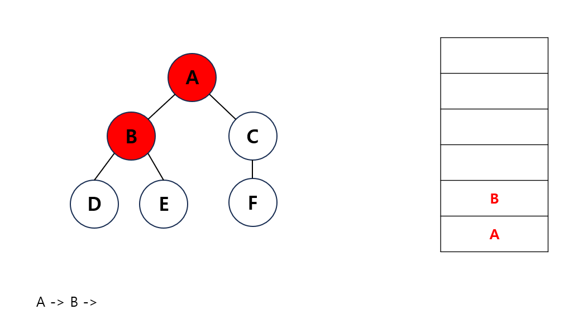
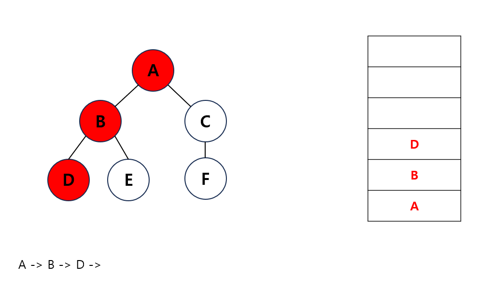
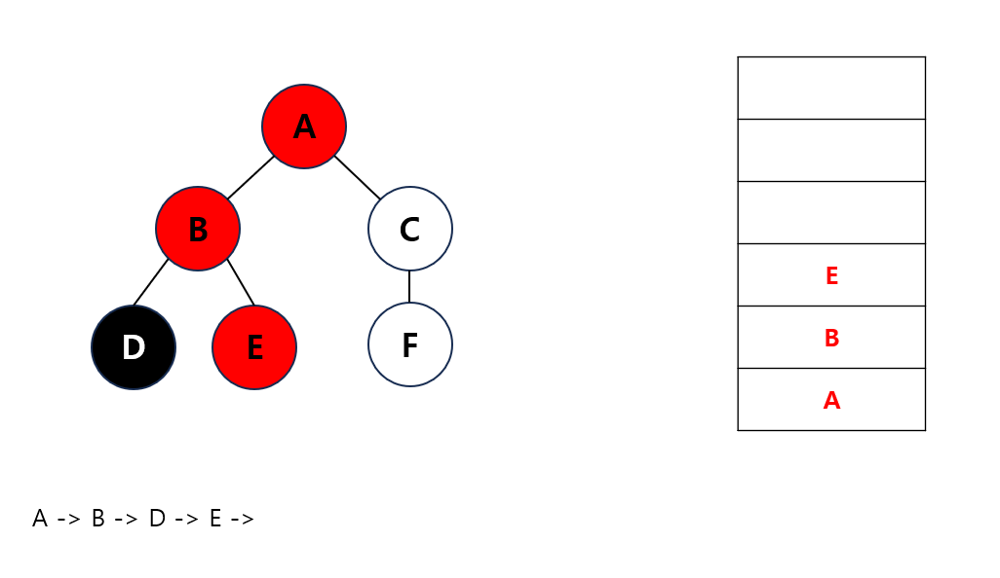
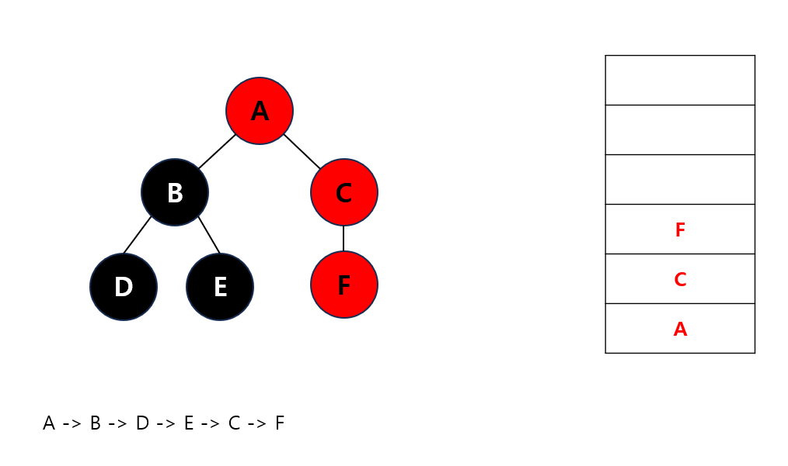

---
layout: simple
title: "DFS"
---

## 깊이 우선 탐색
- root 노드에서 시작해서 다음 분기로 넘어가기 전에 해당 분기를 완벽하게 탐색하는 방법입니다.


#### 
1. 시작 노드를 스택에 넣고 방문 처리합니다.
#### 
2. 스택의 최상단 노드에 방문하지 않은 인접 노드가 있으면 그 노드를 스택에 넣고 방문 처리합니다.
#### 
#### 
3. 방문하지 않은 인접 노드가 없으면 스택에서 최상단 노드를 꺼냅니다.
#### 
4. 더 이상 2번의 과정을 수행할 수 없을 때까지 반복합니다.
#### 


---

```csharp
public void DFS(int start)
{
    if (visited[start]) return;
    visited[start] = true;
    Console.Write(start + " ");
    for (int i = 0; i < graph[start].Count; i++)
    {
        DFS(graph[start][i]);
    }
}
```
