---
layout: simple
title: "Dijkstra"
---

## 다익스트라 알고리즘
- 단일 출발점 최단 경로 알고리즘입니다.
- 다익스트라 알고리즘은 그리디 알고리즘으로, 각 단계에서 가장 가까운 노드를 선택하여 최단 경로를 확장해 나갑니다.

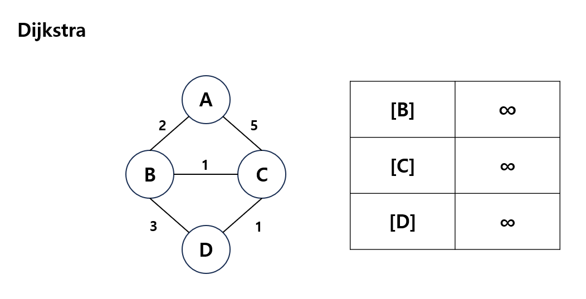
1. 출발 노드를 제외한 나머지 노드와의 거리를 무한대로 설정합니다.
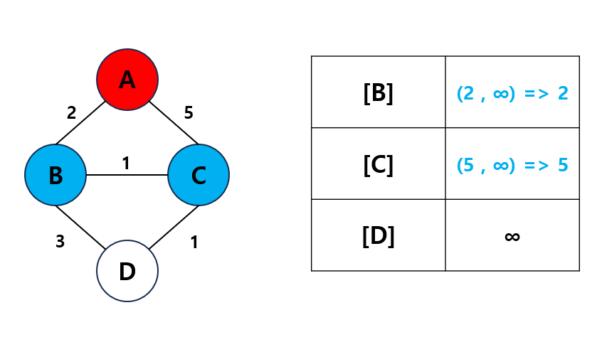
2. 다음 노드는 최소거리의 노드를 선택하고, 연결된 노드들과의 거리를 업데이트 합니다.
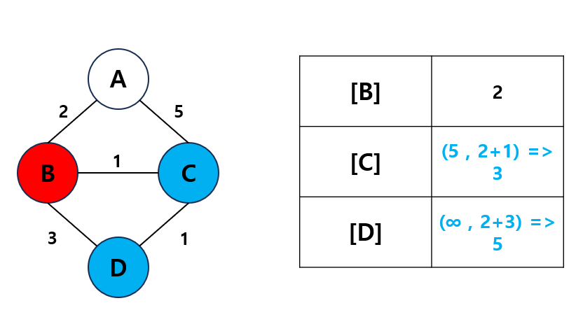
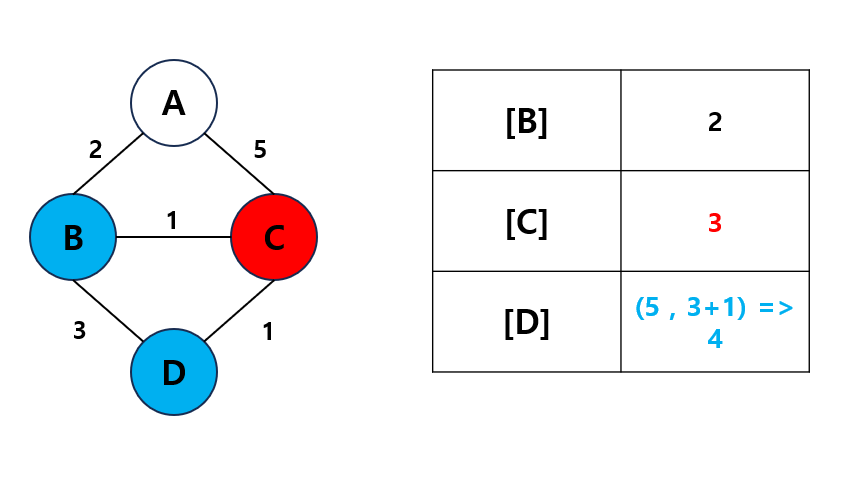
3. 모든 노드를 방문하고나면 알고리즘을 종료합니다.
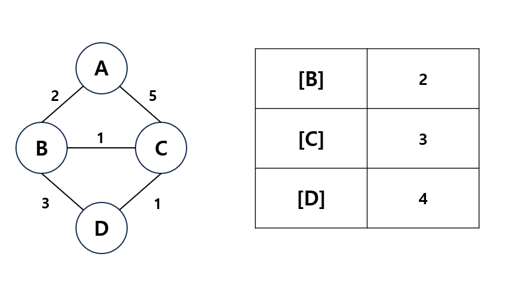

---

## 벨만 포드 알고리즘
- 만약 가중치가 음수가 존재할 경우에 사용하는 알고리즘입니다.
1. 출발 노드를 제외한 나머지 노드와의 거리를 무한대로 설정합니다.
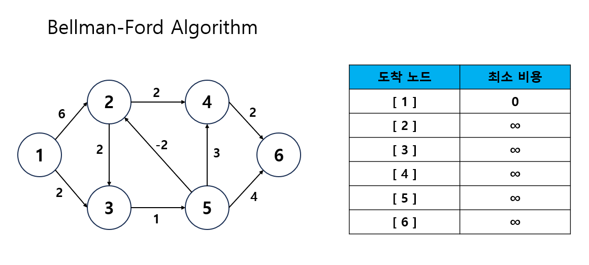
2. 전체 간선 E개를 하나씩 확인합니다.
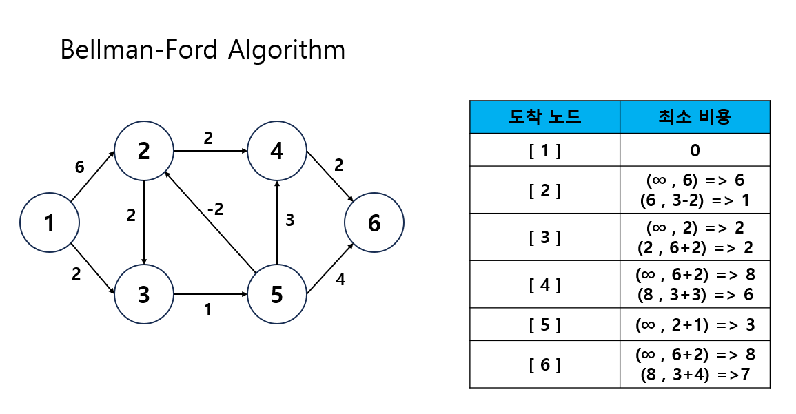
3. 각 간선을 거쳐서 다른 노드로 가는 비용을 계산하여 최단거리 테이블을 갱신합니다.
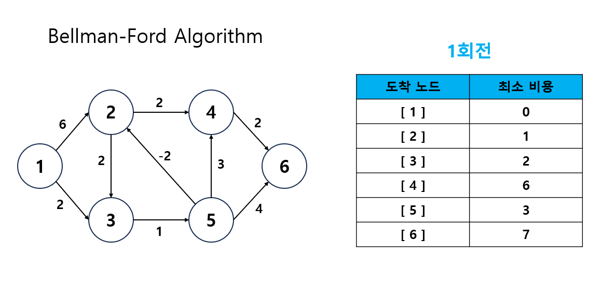
4. 해당 과정을 N-1번 반복합니다.
 - 만약 N-1번 이후에 과정을 한번 더 수행해도 최단거리가 갱신된다면, 음수 간선 순환이 발생한 것입니다.
 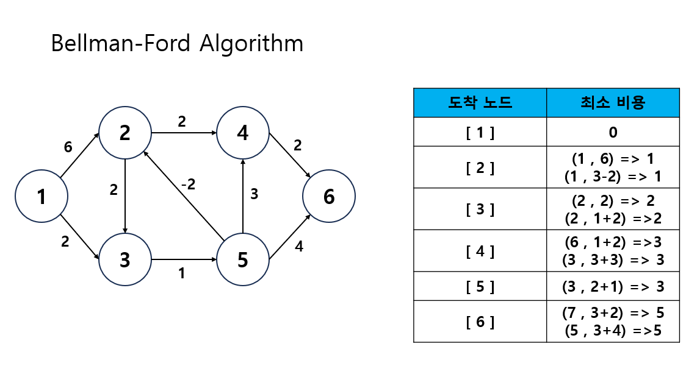
 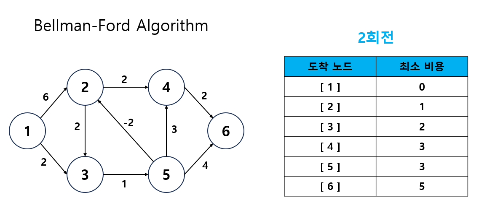
 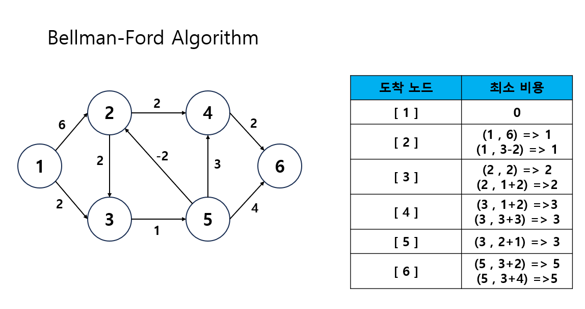
 - 만약 더이상 최단거리 테이블이 갱신되지 않는다면 해당 값이 최단거리 값입니다.
 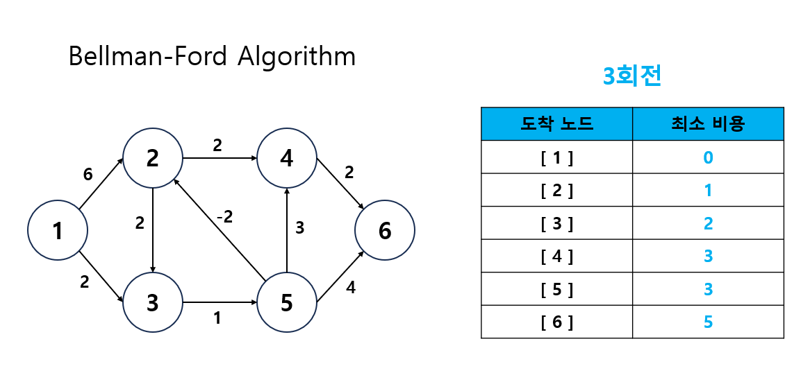

