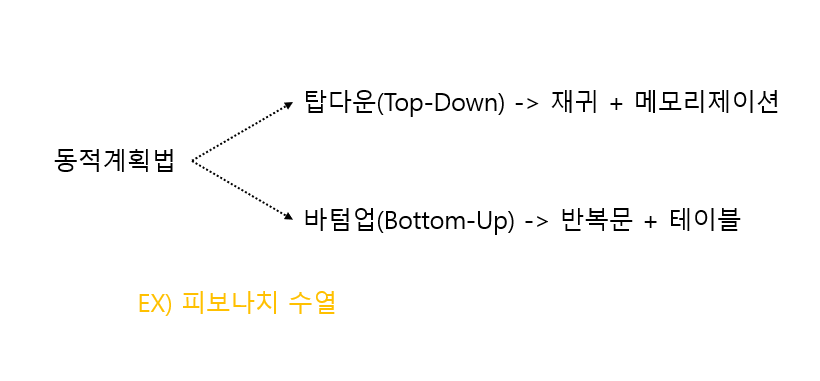
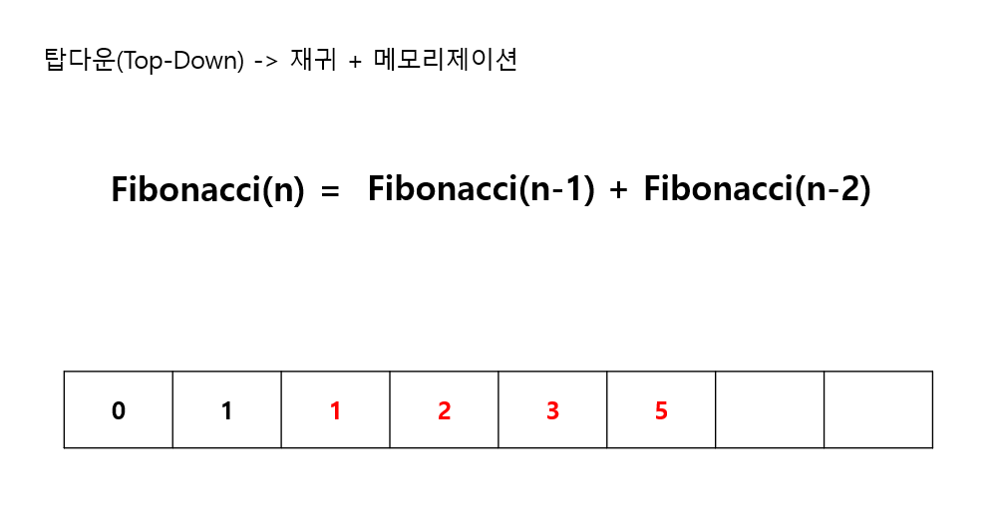
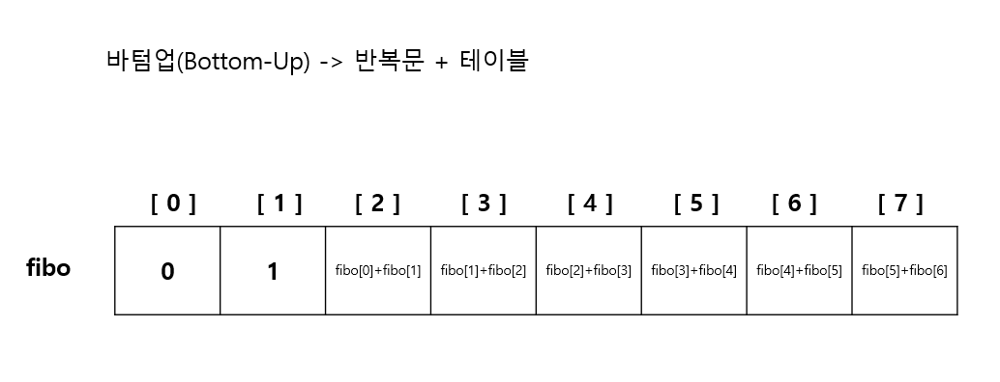

---
layout: simple
title: "DynamicProgramming"
---

## 동적계획법
- 특정 범위까지의 값을 구하기 위해서 그것과 다른 범위까지의 값을 이용하여 효율적으로 값을 구하는 알고리즘입니다.

#### 
#### 
- 메모이제이션
 - 프로그램이 동일한 계산을 반복해야 할 때, 이전에 계산한 값을 메모리에 저장함으로써 동일한 계산을 반복 수행하는 작업을 제거하여 프로그램의 실행 속도를 향상시키는 기법입니다.

 ```csharp
int Fibonacci(int n)
{
    if (n == 1) return 1;
    if (n == 0) return 0;

    return Fibonacci(n - 1) + Fibonacci(n - 2);
}
 ```
#### 


```csharp
int[] arr = new int[100];
int Fibonacci(int[] arr, int n)
{
    if (n <= 1)
    {
        arr[n] = n;
        return arr[n];
    }
    else
    {
        if (arr[n] == 0)
            return arr[n] = Fibonacci(arr, n - 1) + Fibonacci(arr, n - 2);
        else
            return arr[n];
    }
}
```
---
