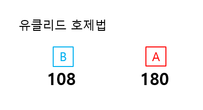
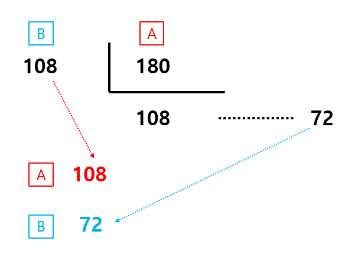
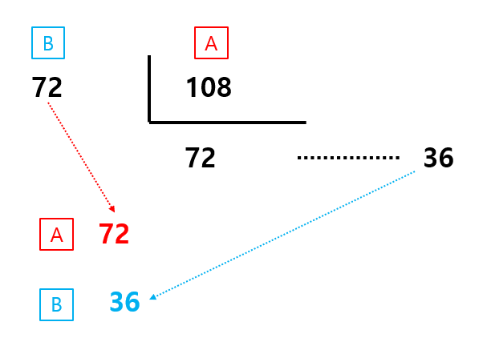
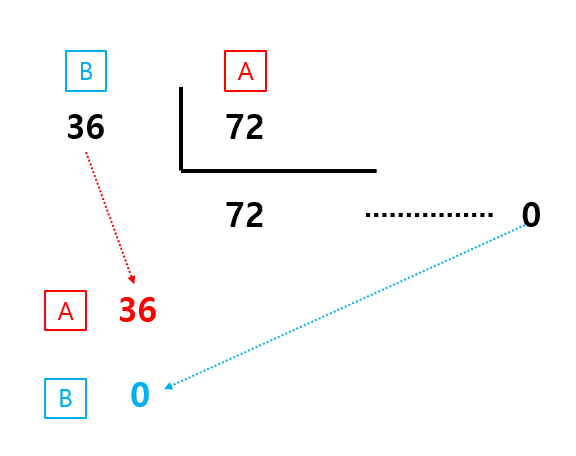

---
layout: simple
title: "유클리드 호제법"
---

## 유클리드 호제법
- 2개의 자연수 또는 정식의 최대공약수를 구하는 알고리즘으로, 두 수가 서로 상대방 수를 나누어서 원하는 수를 얻어내는 알고리즘입니다.

#### 
1. 두 수 a와 b에 대해 a % b를 구합니다.
2. 그 값을 새로운 b로 설정하고, 기존의 b를 새로운 a로 설정합니다.
#### 
#### 
3. 이 과정을 b가 0이 될 때까지 반복합니다. b가 0이 되면, a가 최대공약수입니다.
#### 

```csharp
int Euclid(int num1, int num2)
{
  int A = num1 > num2 ? num1 : num2;
  int B = num1 == A ? num2 : num1;
  int C = A % B;
  if (C == 0)
  {
      return B;
  }
  else
        return Euclid(B, C);
}
```


