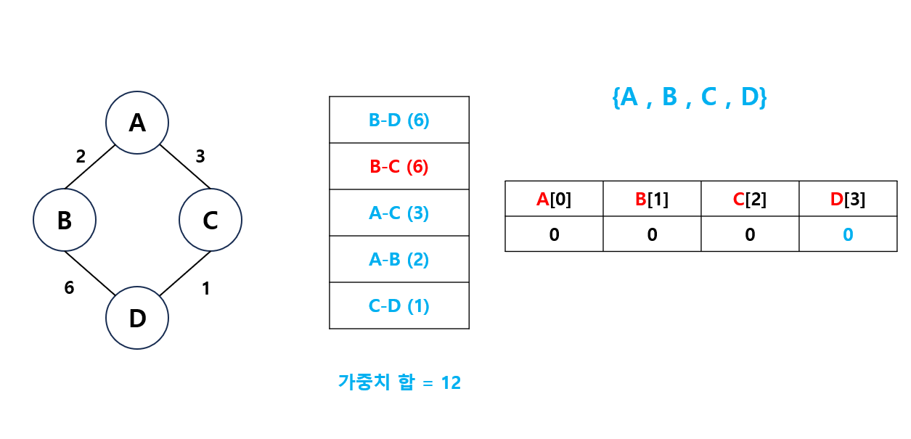

## 크루스칼 알고리즘
- 최소 비용 신장 트리를 구하는 알고리즘입니다.

#### 신장 트리
- 그래프의 모든 정점을 포함하면서 사이클이 존재하지 않는 그래프로, 그래프의 모든 정점을 최소 비용으로 연결하는 트리입니다.
- ```최소 비용 신장 트리``` 
 - 그래프의 간선들의 가중치 합이 최소인 신장 트리


1. 모든 간선을 가중치에 따라 오름차순으로 정렬합니다.

2. 가장 작은 가중치부터 싸이클을 만들지 않게 선택합니다.
 - 유니온 파인드를 통해 루트를 비교하여 싸이클을 확인합니다.
 
 
 
 - 유니온 파인드 규칙을 통해 부모가 같은 노드들은 서로 연결할 수 없습니다.
 

 - 그래프를 모두 순회 후, 최소인 가중치를 구합니다.
 

---

```csharp
 public class Graph
    {
        int size;
        int sum;
        List<Edge> graph;
        int[] parent;

        public class Edge : IComparable<Edge>
        {
            int x, y, distance;

            public Edge(int x, int y, int distance)
            {
                this.x = x;
                this.y = y;
                this.distance = distance;
            }

            public int X
            {
                get { return x; }
                set { x = value; }
            }

            public int Y
            {
                get { return y; }
                set { y = value; }
            }

            public int Distance
            {
                get { return distance; }
                set { distance = value; }
            }

            public int CompareTo(Edge? other)
            {
                return Distance.CompareTo(other.Distance);
            }
        }

        public Graph()
        {
            size = 8;
            sum = 0;
            graph = new List<Edge>();
            parent = new int[size];
            for (int i = 1; i < size; i++)
            {
                parent[i] = i;
            }
        }

        public void Insert(int x, int y, int distance)
        {
            Edge newEdge = new Edge(x, y, distance);
            graph.Add(newEdge);
        }


        public void Kruskal()
        {
            //가중치 그래프를 오름차순으로 정렬
            graph.Sort();

            for (int i = 0; i < graph.Count; i++)
            {
                if (!Same(graph[i].X, graph[i].Y))
                {
                    sum += graph[i].Distance;
                    Union(graph[i].X, graph[i].Y);
                    Console.WriteLine(graph[i].X + " -> " + graph[i].Y + " : " + graph[i].Distance + "(" + sum + ")");
                }
            }
            Console.WriteLine("SUM : " + sum);

        }

        public void Union(int x, int y)
        {
            x = Find(x);
            y = Find(y);

            // 부모가 같은 노드들은 반환합니다.
            if (Same(x, y))
                return;

            // 부모가 같지 않다면 작은 노드로 부모를 전환합니다.
            else
            {
                int p = x < y ? x : y;
                int c = x > y ? x : y;
                parent[c] = p;
            }

        }

        public int Find(int x)
        {
            if (parent[x] == x)
                return x;
            else
            {
                return parent[x] = Find(parent[x]);
            }
        }

        public bool Same(int x, int y)
        {
            return Find(x) == Find(y);
        }
    }
```