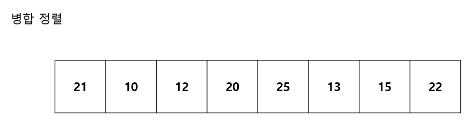
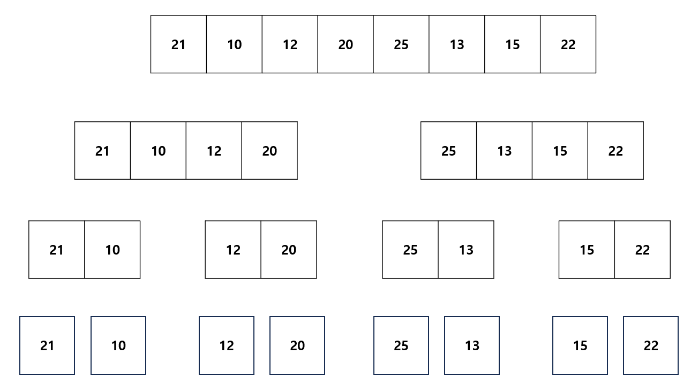
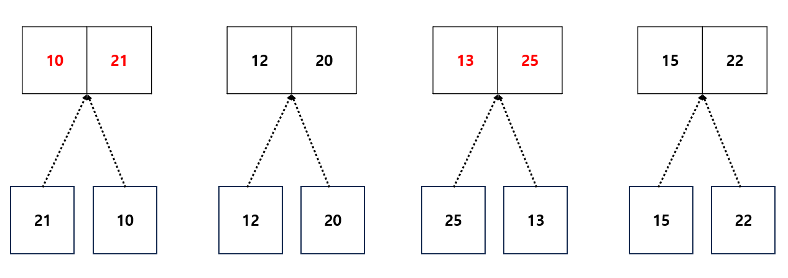
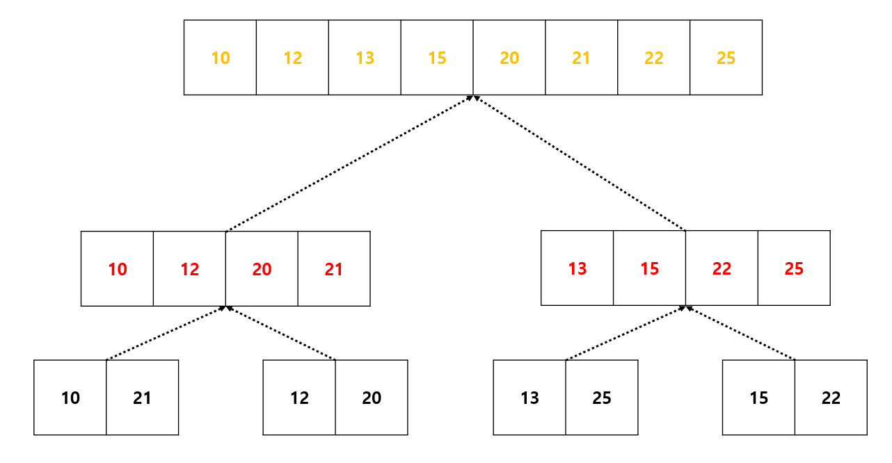

---
layout: simple
title: "Merge Sort"
---

## 병합 정렬
- 하나의 리스트를 두 개의 균등한 크기로 분할하고 분할된 부분 리스트를 정렬한 다음, 두 개의 정렬된 부분 리스트를 합하여 전체가 정렬된 리스트가 되게 하는 방법입니다.
#### 
1. 리스트의 길이가 0 또는 1이면 이미 정렬된 것으로 봅니다.
2. 그렇지 않은 경우
 1. 정렬되지 않은 리스트를 절반으로 잘라 비슷한 크기의 두 부분 리스트로 나눕니다.
#### 
 1. 각 부분 리스트를 재귀적으로 병합정렬을 이용해 정렬합니다.
#### 
 1. 두 부분 리스트를 하나의 정렬된 리스트로 병합합니다.
#### 

```csharp
void MergeSort(int[] list, int start, int end)
{
    if (start < end)
    {
        int middle = (start + end) / 2;
        MergeSort(list, start, (start + end) / 2);//왼쪽
        MergeSort(list, (start + end) / 2 + 1, end);//오른쪽
        Merge(list, start, middle, end);
    }
}
```

---

```csharp
void Merge(int[] list, int start, int middle, int end)
{
    int left = start;
    int right = middle + 1;
    int count = 0;
    int[] tempArr = new int[end - start + 1];
    while (left <= middle && right <= end)
    {
        if (list[left] <= list[right])
        {
            tempArr[count++] = list[left++];
        }
        else
        {
            tempArr[count++] = list[right++];
        }
    }
    while (left <= middle)
    {
        tempArr[count++] = list[left++];
    }
    while (right <= end)
    {
        tempArr[count++] = list[right++];
    }
    for (int i = 0; i < tempArr.Length; i++)
    {
        list[i + start] = tempArr[i];
    }
}
```
