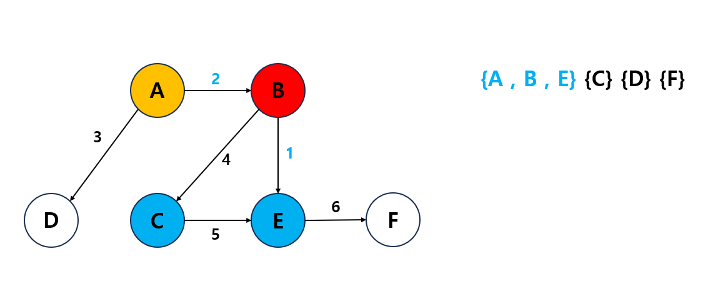

## 프림 알고리즘
- 주어진 연결 그래프에서 주어진 모든 노드를 연결하는 최소 비용의 트리를 구하는 알고리즘입니다.
- 다익스트라와 마찬가지로 그리디 알고리즘에 속하지만, 프림은 최소 신장 트리를 구하는 알고리즘입니다.
- 프림 알고리즘은 우선순위 큐를 사용하여 구현하기 때문에, 전체 간선에 대해서 O(E log V)가 걸립니다.
 - V : 노드의 수  E : 간선의 수
- 모든 간선의 가중치가 양수일 때 최적의 해를 구할 수 있습니다.
1. 임의의 시작 노드를 선택합니다.

2. 인접 노드 확인 후, 최소 간선을 선택합니다.

3. 모든 노드가 포함될때까지 이 과정을 반복합니다.

