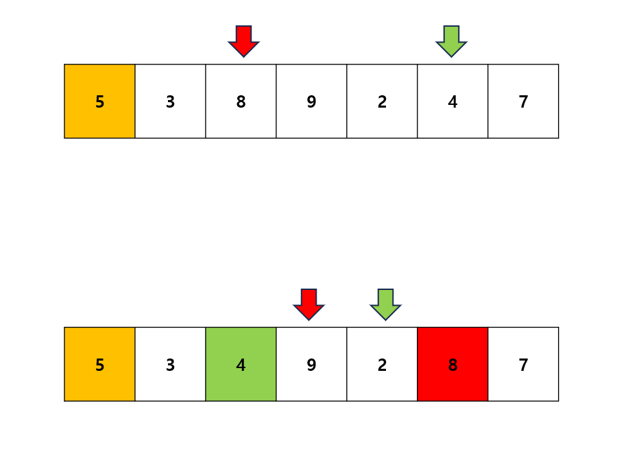
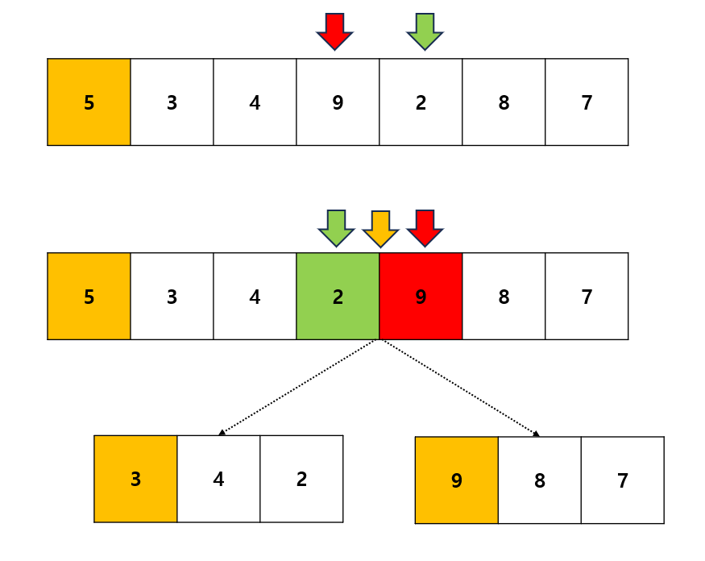
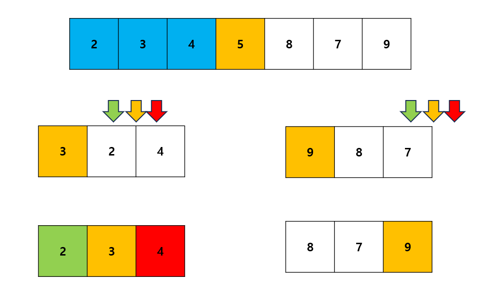
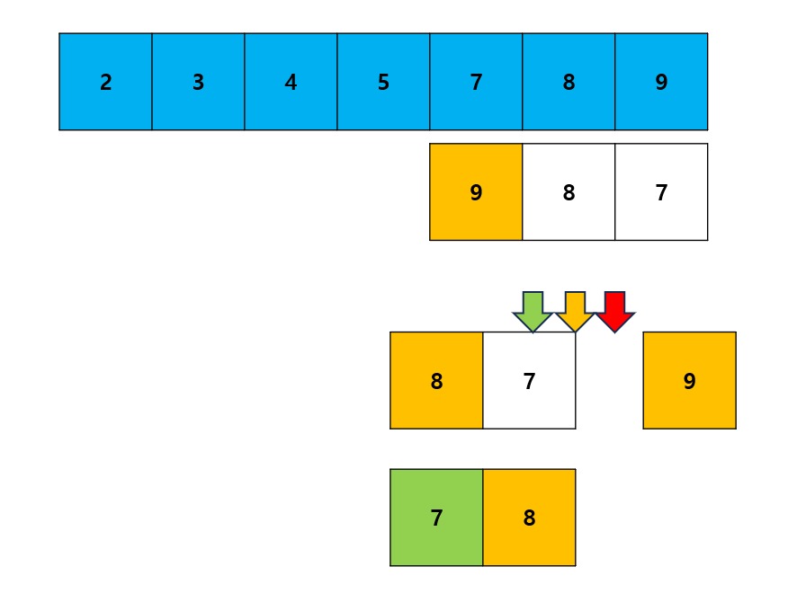

---
layout: simple
title: "Quick Sort"
---

## 퀵 정렬
-  기준점을 획득한 다음 해당 기준점을 기준으로 배열을 나누고 한 쪽에는 기준점보다 작은 값들이 위치하고 다른 한쪽에는 기준점보다 큰 값들이 위치하도록 합니다.
- 나누어진 하위 배열에 대해 재귀적으로 퀵 정렬을 호출하여 모든 배열이 기본 배열이 될 때까지 반복하면서 정렬합니다.
- 퀵 정렬은 평균적으로 O(nlogn)의 시간 복잡도를 가지며,
- 최악의 경우 O(n²)의 시간 복잡도를 가집니다.

#### 
1. 기준점을 선택합니다.
2. 기준점을 기준으로 왼쪽은 기준점보다 큰 값, 오른쪽은 기준점보다 작은 값을 탐색합니다.
#### 
3. 양 방향에서 찾은 두 원소를 교환합니다.
#### 
4. 왼쪽에서 탐색하는 위치와 오른쪽에서 탐색하는 위치가 엇갈리지 않을 때까지 2번으로 돌아가 위 과정을 반복합니다.

5. 엇갈린 기점을 기준으로 두 개의 부분 리스트로 나누어 1번으로 돌아가 해당 부분 리스트의 길이가 1이 될 때까지 반복합니다.
#### 

6. 인접한 부분 리스트끼리 합하여 수행합니다.
#### 


```csharp
void QuickSort(int[] list, int start, int end)
{
    if (start >= end) return;
      int pivot = start;
      int left = start + 1;
      int right = end;
    while (left <= right)
    {
        // left가 end보다 작거나 같고
        // list[left]가 list[pivot]보다 작거나 같을 때까지 반복합니다.
        while (left <= end && list[pivot] >= list[left])
        {
            left++;
        }
        // right가 start보다 크고
        // list[right]가 list[pivot]보다 크거나 같을 때까지 반복합니다.
        while (right > start && list[pivot] <= list[right])
        {
            right--;
        }
        if (left > right)
        {
            Swap(ref list[pivot], ref list[right]);
        }
        else
        {
            Swap(ref list[left], ref list[right]);
        }
    }
    QuickSort(list, start, right - 1);
    QuickSort(list, right + 1, end);
}

```

---
