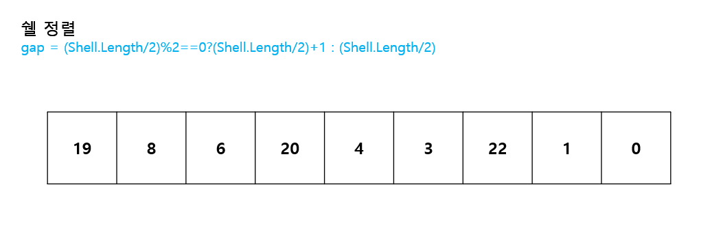
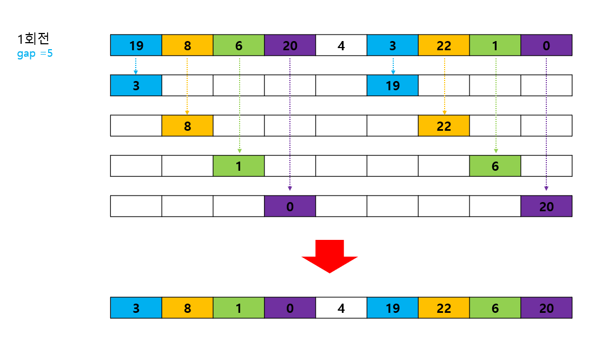
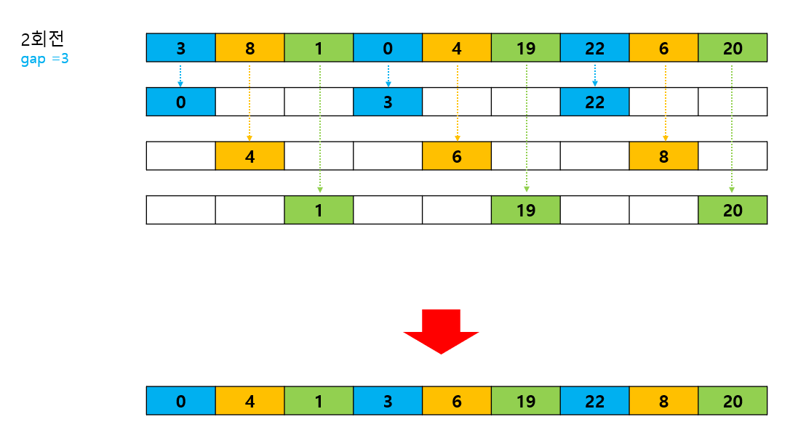
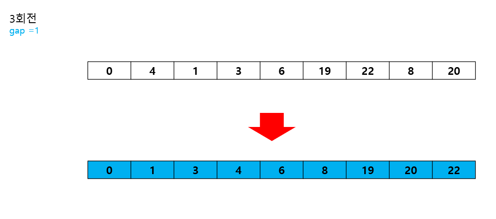

---
layout: simple
title: "Puzzle"
---

## 쉘 정렬
-  먼 거리의 요소들을 먼저 정렬하여 배열을 부분적으로 정렬한 후, 점진적으로 더 작은 간격을 사용하는 정렬 알고리즘입니다.

 1. 먼저 정렬해야 할 리스트를 일정한 기준에 따라 분류합니다.
 2. 연속적이지 않은 여러 개의 부분리스트를 생성합니다.
 3. 각 부분 리스트를 삽입 정렬을 이용하여 정렬합니다.
 4. 모든 부분 리스트가 정렬되면 다시 전체 리스트를 더 작은 개수의 부분 리스트로 만든후에 정렬을 반복합니다.
 5. 리스트의 개수가 1이 될 때까지 반복합니다.
 ---
 - 최초 정렬되지 않은 숫자배열
 - 간격은 홀수가 되게 설정합니다.






```csharp
int[] Shell = new int[] { 19, 8, 6, 20, 4, 3, 22, 1, 0 };

int gap = (Shell.Length / 2) % 2 == 0 ? (Shell.Length / 2) + 1 : (Shell.Length / 2);
int i = 0;
int j = 0;
int key = 0;
for (; gap > 0; gap /= 2)
{
    if (gap % 2 == 0)
        gap++;
    for (i = gap; i < Shell.Length; i++)
    {
        key = Shell[i];
        for (j = i; j >= gap && Shell[j - gap] > key; j -= gap)
        {
            Shell[j] = Shell[j - gap];
        }
                Shell[j] = key;
    }
}

```
