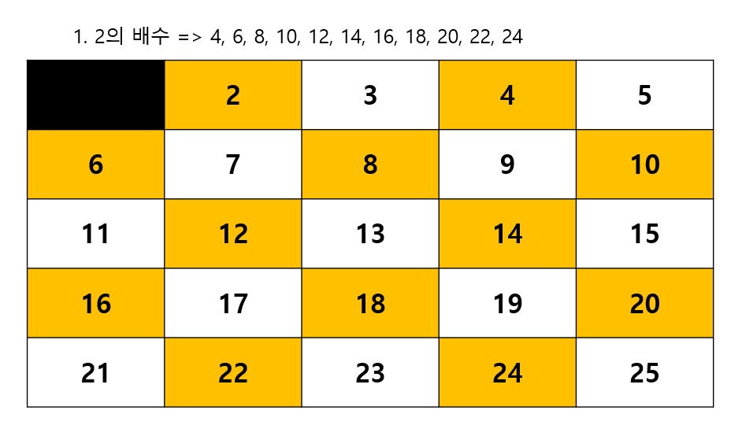
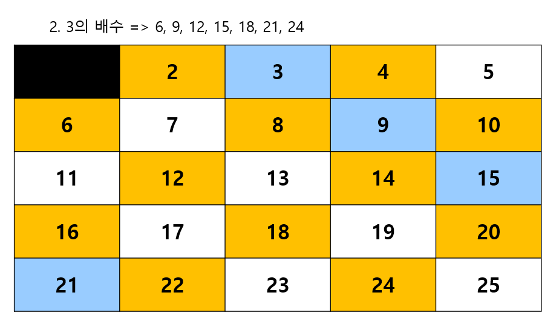
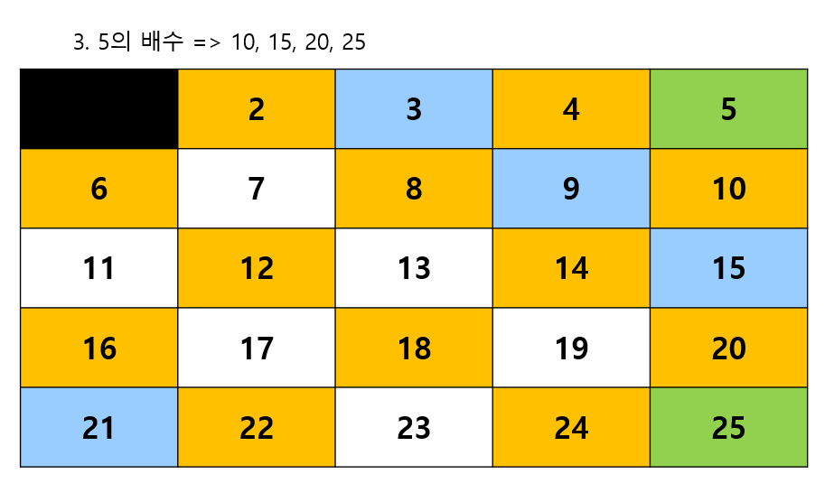
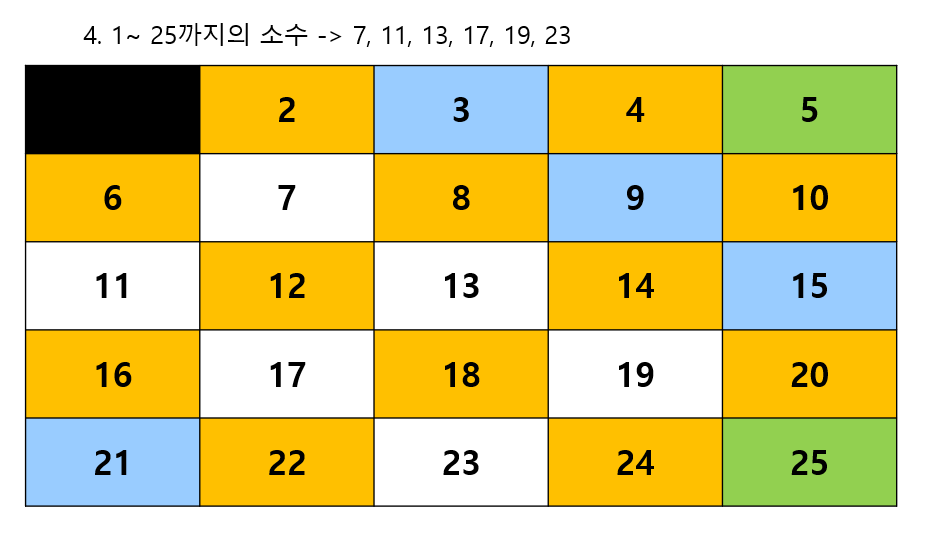

---
layout: simple
title: "에라토스테네스의 체"
---

## ***에라토스테네스의 체***
#### 소수를 판정하는 방법으로, 자연수를 순서대로 늘어놓은 표에서 합성수를 차례대로 지워나가면서 소수의 목록을 얻어내는 방법입니다. 

 - 2부터 원하는 범위의 제곱근값까지 배수를 지웁니다.
 - 지워지지 않은 숫자들의 배수를 과정이 끝날때까지 지웁니다.
 - EX) 25까지 소수판정 
 1. 2의 배수들을 제거합니다.


 2. 3의 배수들을 제거합니다.
 

 3. 5의 배수들을 제거합니다.
 

 4. 7의 배수들을 제거하고 25의 제곱근 값을 넘었으므로 나머지 수를 소수로 판별합니다.
 

 ```csharp
static public bool IsPrime(int num)
{
    bool[] pivot = new bool[num + 1];
    int size = (int)Math.Sqrt(num) + 1;
    for (int i = 2; i < size; i++)
    {
        if (!pivot[i])
        {
            for (int j = 2; ; j++)
            {
                if (i * j > num)
                    break;
                pivot[i * j] = true;//합성수는 true 기본은 false
            }
        }
    }
    return !pivot[num];
}

 ```