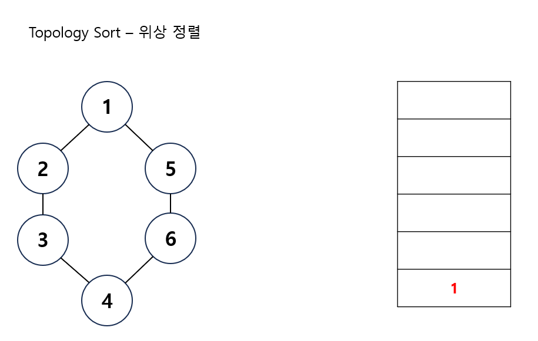
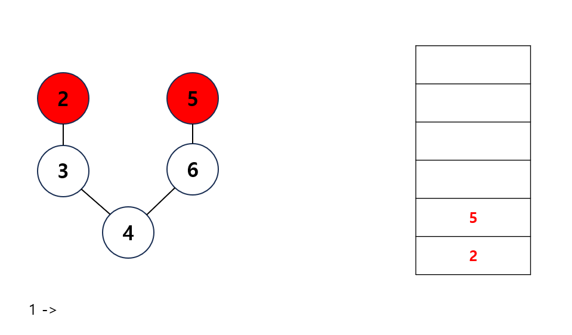
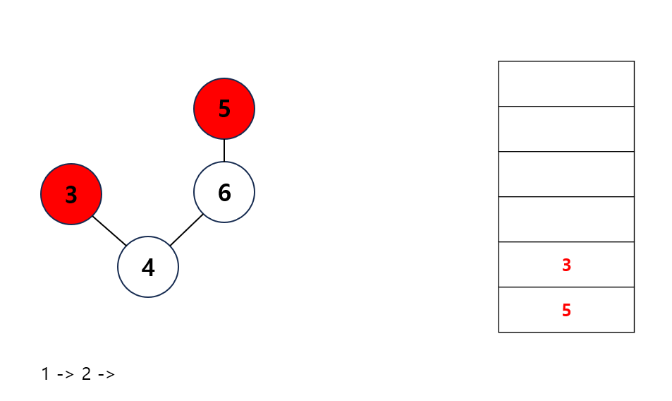
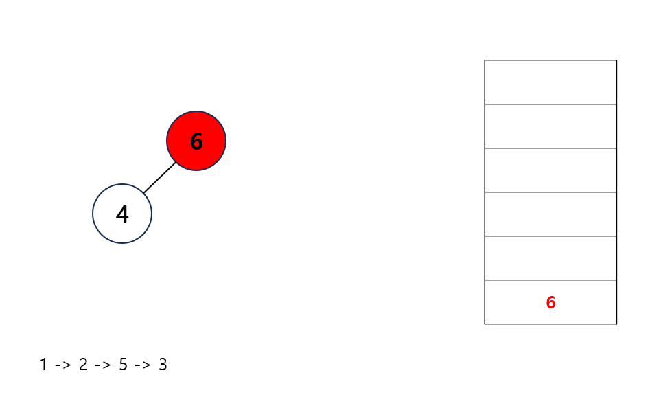
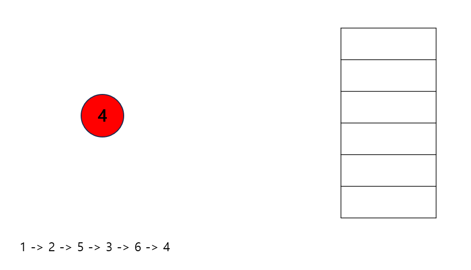

---
layout: simple
title: "TopologySort"
---

## 위상 정렬
- 방향 그래프에 존재하는 각 정점들의 선생 순서를 지키며 모든 정점을 차례대로 진행하는 알고리즘입니다.
- 사이클이 발생하는 경우 위상 정렬을 수행할 수 없습니다.
- DAG(Directed Acyclic Graph) : 사이클이 존재하지 않는 그래프

---
 1. 진입차수가 0인 정점을 Queue에 삽입합니다.
 
 2. Queue에 원소를 꺼내 연결된 모든 간선을 제거합니다.
 3. 간선 제거 이후에 진입 차수가 0이 된 정점을 Queue에 삽입합니다.
 
 4. Queue가 비어있을 때까지 2번 3번을 반복 수행합니다.
  
  
  

```csharp
public void Sort()
{
    // 최초에 진입 차수가 0인 정점들을 Queue에 집어넣는다.
    for (int i = 1; i < degree.Length; i++)
    {
        if (degree[i] == 0)
        {
            queue.Enqueue(i);
            degree[i]--;
        }
    }

    // Queue의 정점개수가 0이 될때까지 과정을 반복한다.
    while (queue.Count > 0)
    {

        int cur = queue.Dequeue();
        Console.Write(cur + " ");

        // Queue에 가장 앞에 있는 정점을 진입차수로 가지는 정점들의 count를 1씩 줄인다.
        for (int i = 0; i < list[cur].Count; i++)
        {
            degree[list[cur][i]]--;
            if (degree[list[cur][i]] == 0)
            {
                queue.Enqueue(list[cur][i]);
            }
        }
    }//while
}
```
