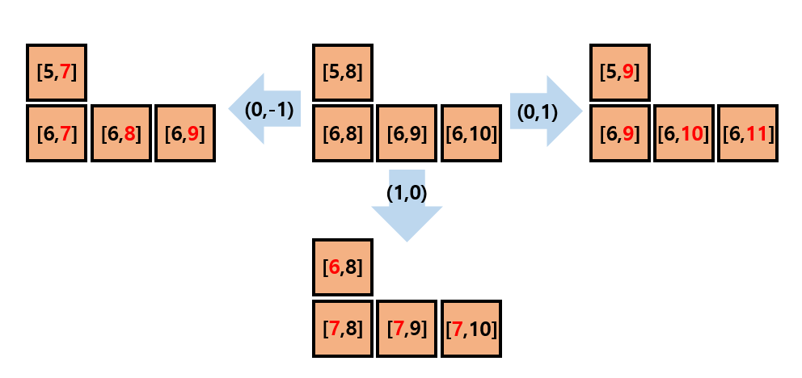
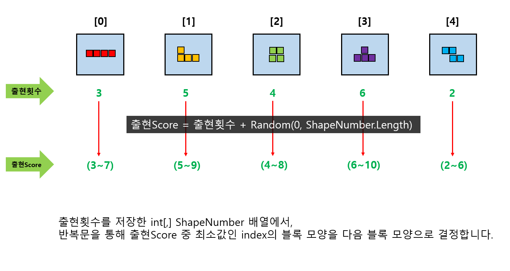

---
layout: simple
title: "TETRIS"
---  

<iframe width="600" height="500" src="https://www.youtube.com/embed/3Ebe93ZsSiY" title="" frameborder="0" allow="accelerometer; autoplay; clipboard-write; encrypted-media; gyroscope; picture-in-picture; web-share" referrerpolicy="strict-origin-when-cross-origin" allowfullscreen></iframe>  

# “블럭의 회전과 이동” #  

## 1. Tetris Map의 구성 ##  

####  ####  

### CheckMove()함수를 통해 이동할 수 있는지 확인한 후 블럭을 이동시킵니다.
#### -외벽인 "3"과 멈춰진 블록인 "1"의 경우 이동불가합니다.  

```

   public static bool CheckMove(int[,] temp, int[,] map)
{
    for(int i = 0; i < temp.GetLength(0); i++)
    {
        if (temp[i, 0] < 0 || temp[i, 0] >= map.GetLength(0) - 1 
        || temp[i, 1] <= 0 || temp[i, 1] >= map.GetLength(1) - 1)
        {
            keyCheck = false;
            return false;
        }

        if (map[temp[i,0], temp[i, 1]] == 1
        ||map[temp[i,0], temp[i, 1]] == 3)
        {
           keyCheck = false;
            return false;
        }
    }         
    return true;
}
  
  ```


## 2. 블록 이동

####  ####  

### (1) int[,] map에 이동할 좌표를 저장한 후,
### DoubleBuffer를 이용하여 변경된 부분만 Console.SetCursorPosition() 을 통해 블록을 이동해 줍니다.  

## 3. 블록 회전

#### .PNG) ####  

### (1) Pivot이 되는 부분을 정해서, 해당 부분을 원점으로 이동시킵니다.
#### -이 때, 이동한 만큼의 거리값을 저장시켜놓습니다.  

#### .PNG) ####  

### (2) 원점을 중심으로 한 회전은 (x,y) => (x*cos(θ)-y*sin(θ), x*sin(θ)+y*cos(θ))
### - 90도 회전시 cos(90)은 0 이라서 (x,y) => (-y,x)가 되므로 그에 맞게 좌표를 변경시켜 줍니다.

### (3) 회전한 도형의 Pivot을 아까 저장해놓은 거리값을 이용해 원위치로 이동시킵니다.
   

## 4. 블록 모양 결정
####  ####  

### > 가중치를 이용하여 최대한 여러가지 모양이 나올 수 있도록 계획하였습니다.
### > 많이 나온 모양일수록 다음으로 뽑힐 확률을 줄이고, 최대한 적게 나온 모양이 나오게 하면서도, 많이 나온 모양이 안나오진 않을 수 있도록 계획 했습니다.
 

 ## 5. GameOver ##
 ####  #### 

 ### > GameOver판정을 받게되면 Ending Scene이 나오면서 게임이 종료됩니다.
   

