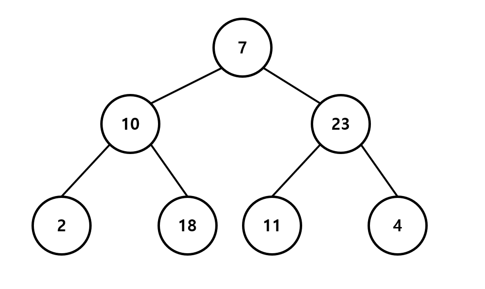
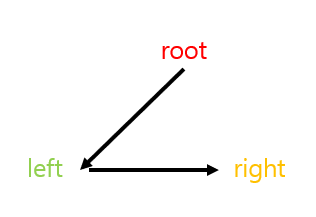
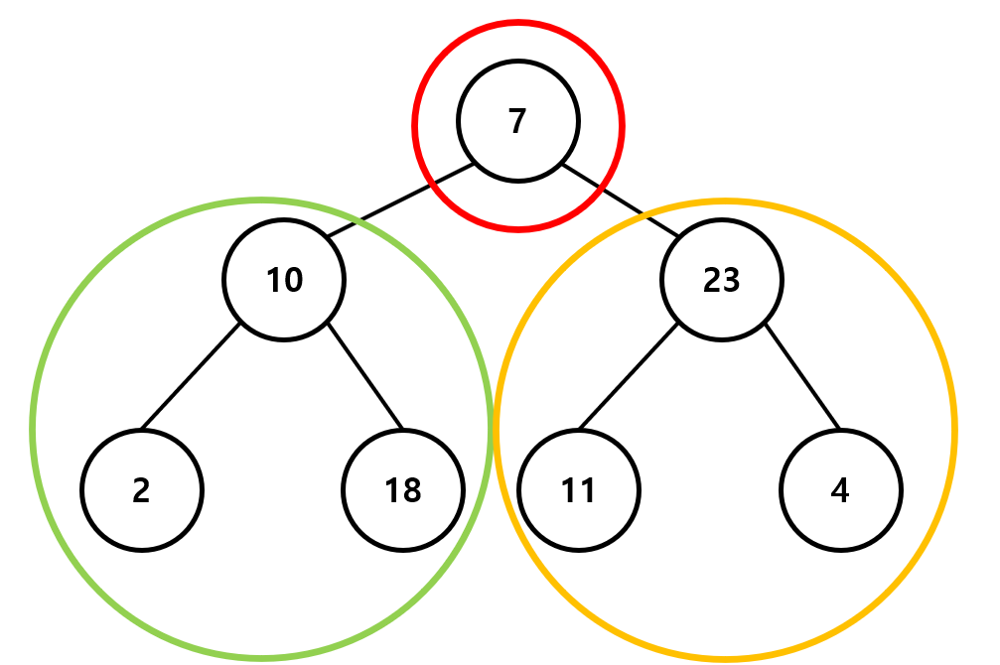
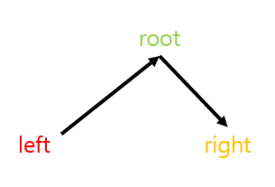
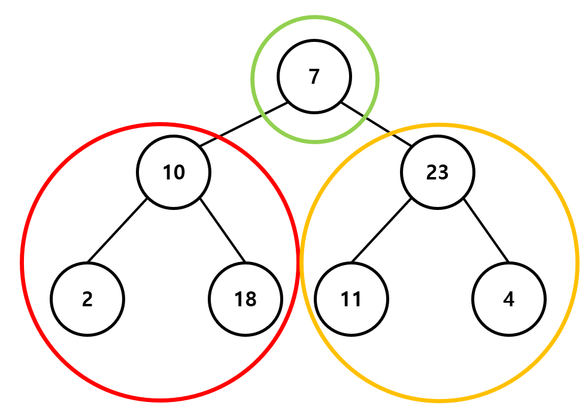
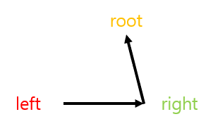
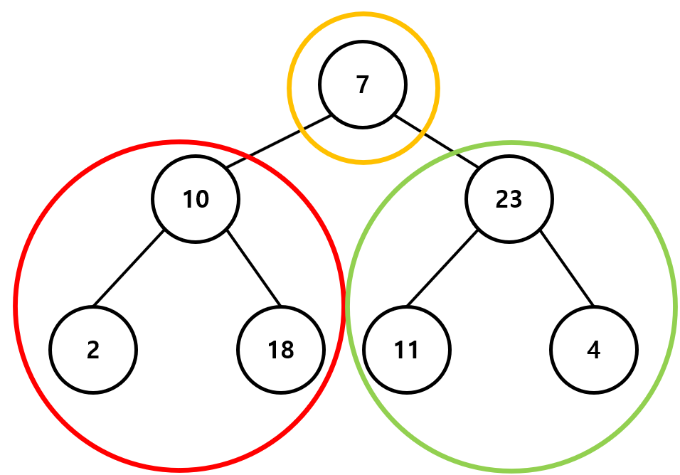

---
layout: simple
title: "BinaryTree"
---

## BinaryTree

- 각 노드가 최대 두 개의 자식 노드를 가질 수 있는 트리 구조의 자료구조입니다.

### 1. 노드(Node)

- 트리의 각 요소를 의미하며, 데이터를 포함하고 있습니다. 각 노드는 왼쪽 자식과 오른쪽 자식을 가리키는 포인터(참조)를 가집니다.

### 2. 루트(Root)

- 트리의 최상위 노드입니다. 트리 내의 모든 노드는 루트에서 시작하여 아래로 연결됩니다.

### 3. 자식 노드(Child Nodes)

- 각 노드는 최대 두 개의 자식 노드를 가질 수 있습니다. 왼쪽 자식 노드를 Left Child, 오른쪽 자식 노드를 Right Child라고 합니다.

### 4. 잎 노드(Leaf Node)

- 자식 노드가 없는 노드를 잎(leaf) 노드라고 부릅니다.

### 5. 서브트리(Subtree)

- 노드와 그 하위 자식들을 이루는 트리를 서브트리라고 부릅니다.

- 이진 트리의 종류

### 1. 이진 탐색 트리(Binary Search Tree, BST)

- 각 노드의 왼쪽 서브트리에는 해당 노드보다 작은 값들이, 오른쪽 서브트리에는 해당 노드보다 큰 값들이 저장되는 트리입니다.
- BST를 사용하면 검색, 삽입, 삭제 연산이 평균적으로 O(log n)의 시간 복잡도를 가집니다.

### 2. 균형 이진 트리(Balanced Binary Tree)

- AVL 트리나 레드-블랙 트리처럼 트리의 높이가 최소화되도록 유지되는 트리입니다.
- 균형이 유지되면 트리의 성능이 최적화됩니다.

### 3. 완전 이진 트리(Complete Binary Tree)

- 마지막 레벨을 제외한 모든 레벨이 완전히 채워져 있으며, 마지막 레벨에서는 왼쪽부터 순서대로 채워진 트리입니다.

### 4. 포화 이진 트리(Full Binary Tree)

- 모든 노드가 0개 또는 2개의 자식 노드를 가지는 트리입니다.

### 5. 전 이진 트리(Perfect Binary Tree):

- 모든 내부 노드가 정확히 두 개의 자식을 가지며, 모든 잎 노드가 동일한 깊이를 가지는 트리입니다.

- 트리 순회 방식
- 트리예시

#### 

### 1. Preorder

#### 

#### 

```csharp
static public void Preorder(Node root)
{
   if (root != null)
   {
       Console.Write(root.data + " ");
       Preorder(root.left);
       Preorder(root.right);
   }
}
```

- 7 -> 10 -> 2 -> 18 -> 23 -> 11 -> 4

### 2. InOrder

#### 

#### 

```csharp
static void InOrder(Node root)
{
    if (root != null)
    {
        InOrder(root.left);
        Console.Write(root.data + " ");
        InOrder(root.right);
    }
}
```

- 2 -> 10 -> 18 -> 7 -> 11 -> 23 -> 4

### 3. PostOrder

#### 

#### 

```csharp
static void PostOrder(Node root)
{
    if (root != null)
    {
        PostOrder(root.left);
        PostOrder(root.right);
        Console.Write(root.data + " ");
    }
}
```

- 2 -> 18 -> 10 -> 11 -> 4 -> 23 -> 7

---

- 이진 탐색 트리(Binary Search Tree, BST)
- 각 노드의 왼쪽 서브트리에는 해당 노드보다 작은 값들이, 오른쪽 서브트리에는 해당 노드보다 큰 값들이 저장되야하기 때문에,
- 노드의 삭제 시, 구조의 유지를 위해 규칙에 맞게 삭제해야 합니다.

### 1. 삭제하고자 하는 노드가 리프 노드인 경우

- 타겟이 되는 노드만 삭제합니다.

### 2. 삭제하고자 하는 노드에게 자식 노드가 1개만 있는 경우

- 타겟이 되는 노드를 삭제하고 자식노드를 삭제된 위치로 이동시킵니다.

### 3. 삭제하고자 하는 노드에게 자식 노드가 2개 있는 경우

- 타겟이 되는 노드의 오른쪽 자식중 가장 작은 노드를 찾아 삭제할 위치로 이동시킵니다.

```csharp
public void Remove2(int data)
{
    Node cur = root;
    Node parent = root;

    while (cur != null)
    {
        if (cur.data > data)
        {
            parent = cur;
            cur = cur.left;
        }

        else if (cur.data < data)
        {
            parent = cur;
            cur = cur.right;
        }

        // cur.data==data인 경우
        else
        {
            // 자식노드가 없는 경우
            if (cur.right == null && cur.left == null)
            {
                if (parent.data > data)
                    parent.left = null;
                else
                    parent.right = null;
            }

            else
            {
                // 왼쪽 자식만 존재하는 경우
                if (cur.right == null && cur.left != null)
                {
                    if (parent.data > cur.data)
                        parent.left = cur.left;
                    else
                        parent.right = cur.left;
                }
                // 오른쪽 자식만 존재하는 경우
                else if (cur.right != null && cur.left == null)
                {
                    if (parent.data > cur.data)
                        parent.left = cur.right;
                    else
                        parent.right = cur.right;
                }
                // 자식이 2개 모두 존재하는 경우
                else
                {
                    Node tempParent = cur;
                    // 삭제할 노드의 오른쪽 자식을 할당합니다.
                    Node temp = cur.right;
                    // 오른쪽 자식 중 가장 작은 노드찾기
                    while (temp.left != null)
                    {
                        tempParent = temp;
                        temp = temp.left;
                    }
                    // 타겟 노드보다 큰 노드중 가장 최소값을 찾게 됩니다.
                    cur.data = temp.data;
                    if (tempParent.data > temp.data)
                        tempParent.left = temp.right;
                    else
                        tempParent.right = temp.right;
                }
            }
            break;
        }
    }//while
}
```
