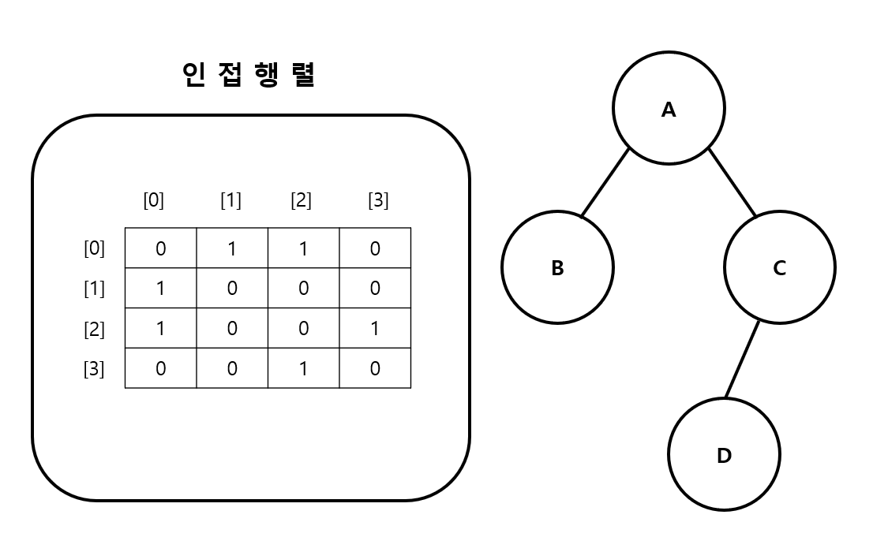
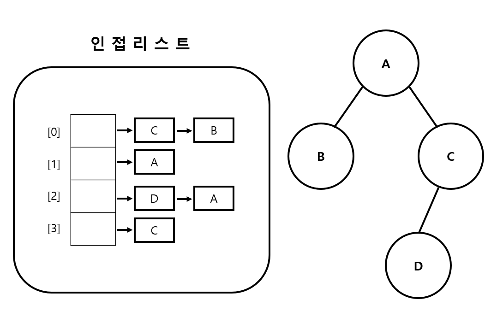

---
layout: simple
title: "Graph"
---

## 요소들이 서로 복잡하게 연결되어 있는 관계를 표현하는 자료 구조이며, ***정점(Vertex)***과 ***간선(Edge)***들의 집합으로 구성되어 있습니다.

### 정접(Vertex)
- 노드(Node) 데이터가 저장되는 그래프의 기본 원소입니다.

### 간선(Edge)
- 노드들을 연결하는 선입니다.

### 인접 정점(Adjacent Vertex)
- 간선으로 직접 연결된 정점을 의미합니다.

### 차수(Degree)
- 정점에 연결된 간선의 수를 의미합니다.

### 경로(Path)
- 정점들을 연결하는 간선들의 순서입니다.

## 그래프의 종류

1. 무방향 그래프
 - 간선에 방향이 없는 그래프입니다.

2. 방향 그래프
 - 간선에 방향이 있는 그래프입니다.

3. 가중치 그래프
 - 간선에 가중치가 있는 그래프입니다.

## 인접 행렬(Graph_Adjacency_Matrix)
- 정점들 간의 연결 관계를 2차원 배열로 표현하는 방식입니다.
- 정점의 개수가 V일 때  V x V 크기의 2차원 배열을 사용합니다.
#### 
### 장점
 - 두 정점이 연결되어 있는지 확인하기 쉽습니다.
 - 두 정점 사이의 가중치를 쉽게 확인할 수 있습니다.
### 단점
 - 정점의 개수가 많을 때 메모리 낭비가 심합니다.

## 인접 리스트(Graph_Adjacency_List)
 - 그래프의 각 정점에 인접한 정점들을 연결리스트로 표현하는 방법입니다.
#### 
### 장점
 - 그래프의 모든 간선의 수를 O(V+E)로 표현할 수 있습니다

### 단점
 - 두 정점을 연결하는 간선을 조회하거나 정점의 차수를 알기 위해 정점의 인접 리스트를 모두 탐색해야 하므로, 정점의 차수만큼의 시간이 필요합니다.

