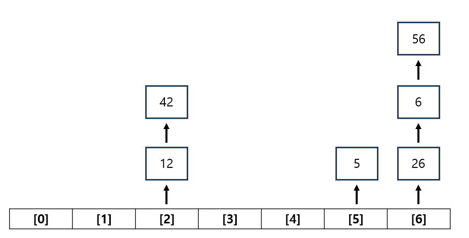

## HashTable

- 데이터를 키-값(key-value) 쌍으로 저장하는 자료 구조입니다.
- 해시 테이블은 빠른 검색, 삽입, 삭제를 위해 해시 함수를 사용하여 데이터를 저장하고 검색하는 데 중점을 둡니다.
- Hashtable은 고유한 키를 가지기 때문에, 동일한 키를 사용해 값을 삽입하려 하면 기존 값이 새로운 값으로 덮어쓰여집니다.
- Hashtable은 키-값 쌍을 해시 함수의 결과에 따라 저장하므로, 데이터가 저장된 순서와 관계없이 저장됩니다.
- HashTable구조 구현

```csharp
public class HashTable<Key, Value>
{
    private readonly int arraySize;
    private Bucket[] bucket;

    public class Node
    {
        public Key key;
        public Value value;

        public Node next;

        public Node(Key key, Value value)
        {
            this.key = key;
            this.value = value;
            next = null;
        }
    }

    //각 키 값의 value들을 담을 연결리스트
    public class Bucket
    {
        public int count;
        public Node head;

        public Bucket()
        {
            count = 0;
            head = null;
        }
    }

    //생성자
    public HashTable()
    {
        arraySize = 6;
        bucket = new Bucket[arraySize];
        for (int i = 0; i < arraySize; i++)
        {
            Bucket newBucket = new Bucket();
            bucket[i] = newBucket;
        }
    }
}
```

- `체이닝`
- 체이닝은 해시 충돌을 해결하는 방법 중 하나로, 해시 충돌이 발생할 때 동일한 인덱스에 있는 데이터를 링크드 리스트로 연결해 저장합니다.

#### 

---

### HashTable 추가와 삭제

- 키 값이 배열의 크기를 넘어가면 `키 값 = 키 값 % (배열의 길이)` 위치에 삽입합니다.

```csharp
 private int HashFunction(Key key)
 {
     int result = 0;
     result = int.Parse(key.ToString()) % arraySize;
     return result;
 }
```

- HashTable 추가 구현

```csharp
public void Insert(Key key, Value value)
{
   int index = HashFunction(key);
   Node newNode = CreateNode(key, value);

   if (bucket[index].head == null)
   {
       bucket[index].head = newNode;
   }

   else
   {
       Node curNode = bucket[index].head;
       while(curNode.next != null)
       {
           curNode=curNode.next;
       }
       curNode.next = newNode;
       bucket[index].head = newNode;
   }
   bucket[index].count++;
}
```

- HashTable 삭제 구현

```csharp
public void Remove(Key key)
{
  int index = HashFunction(key);

  if (bucket[index].head != null)
  {
      Node cur = bucket[index].head;
      Node prev = cur;

      while (cur != null)
      {
          if (cur.key.ToString() == key.ToString())
          {
              if (cur == prev)
              {
                  bucket[index].head = cur.next;
                  cur = null;
              }

              else
              {
                  prev.next = cur.next;
              }
              bucket[index].count--;
              return;
          }

          prev = cur;
          cur = cur.next;
      }
      Console.WriteLine("Key is not exist");
  }
  else
  {
      Console.WriteLine("Table is Empty");
  }
}
```
