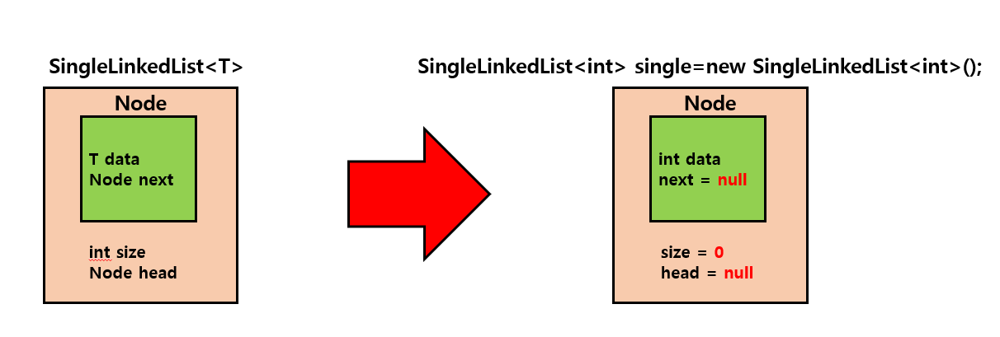
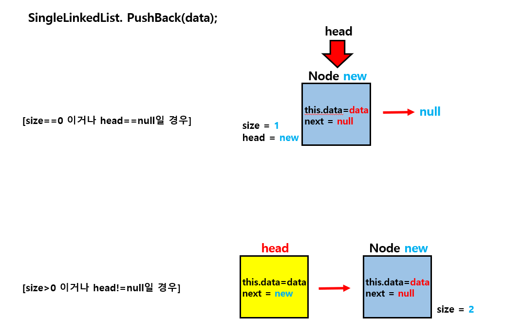
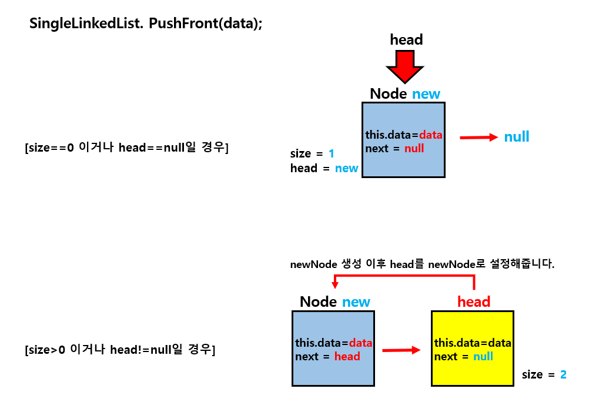
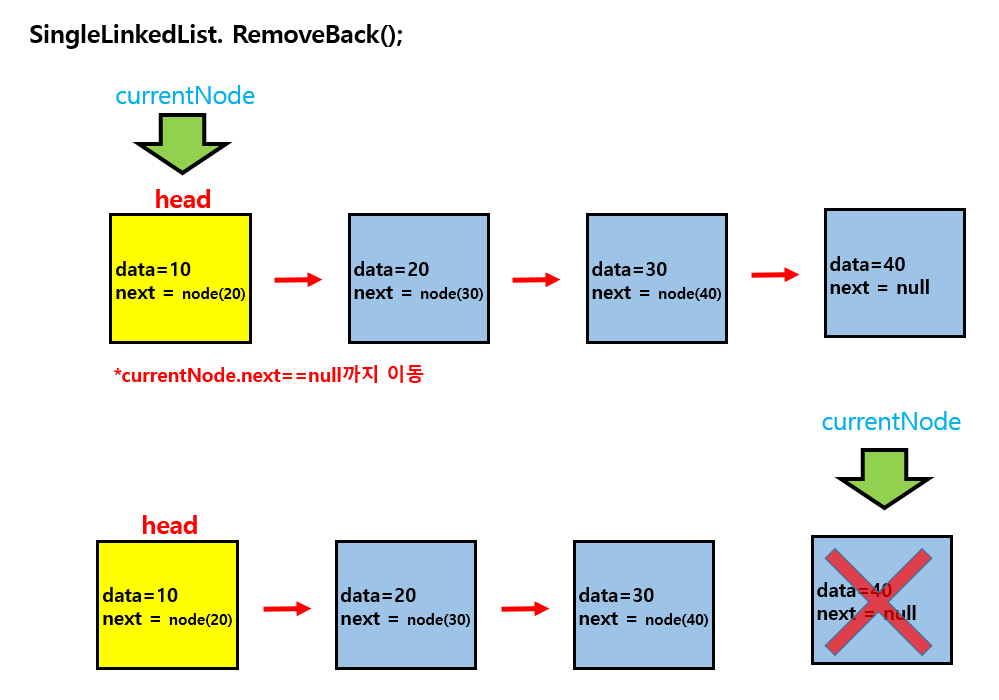
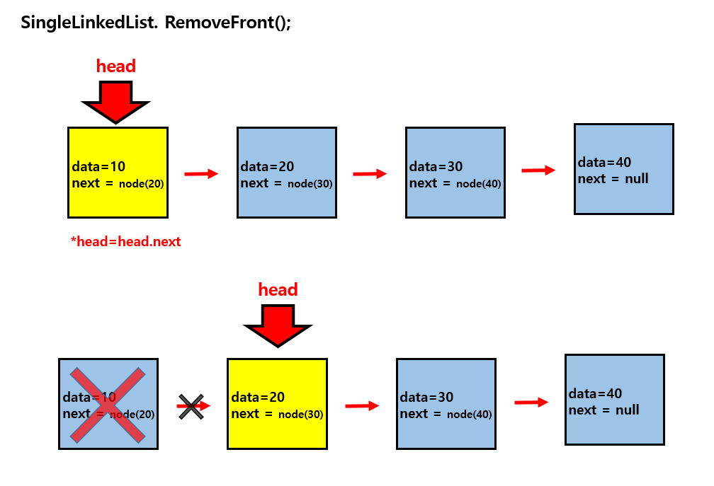

## SingleLinkedList

- 각 노드가 다음 노드에 대한 참조를 가지는 데이터 구조입니다.
- head는 리스트의 가장 앞의 노드를 가리키는 참조변수입니다.
- next는 현재 노드의 다음 노드를 가리키는 참조변수입니다.

### Node

- 제네릭타입을 이용해서 컴파일 시 타입 안전성을 보장합니다.

#### 

#

### PushBack(data)

- 리스트의 가장 마지막에 새로운 데이터를 가지는 노드를 추가합니다.

#### 

#

### PushFront(data)

- 리스트의 가장 앞에 새로운 데이터를 가지는 노드를 추가합니다.
- 추가한 이후 head가 새로 추가한 노드를 가리키게 합니다.

#### 

#

### RemoveBack()

- 리스트의 가장 뒤에 있는 노드를 삭제합니다.
- 직접적인 삭제가 아닌, 이전노드의 next에 null을 할당함으로써, 참조가 안되게 하여 가비지 콜렉터에 의해 삭제되게 합니다.
- 만약 리스트에 존재하는 노드가 head 하나뿐이라면, 삭제이후 head에 null을 할당합니다.

#### 

#

### RemoveFront()

- 리스트의 가장 앞에 있는 노드를 삭제합니다.
- head가 head의 다음 노드를 가리키게 합니다.
  1.  원래 head였던 노드는 아무도 참조하지 않아서 가비지 콜렉터에 의해 삭제됩니다.
  2.  만약 head 다음 노드가 존재하지 않는다면 head에는 head.next인 null이 할당됩니다.
- 만약 리스트에 존재하는 노드가 head 하나뿐이라면, 삭제이후 head에 null을 할당합니다.

#### 

### Show()

- 최초 head를 가리키는 curNode를 선언하여 리스트의 끝까지 출력합니다.

```csharp
 if (head != null)
 {
     Node curNode = head;
     while (true)
     {
         Console.WriteLine(curNode.data);
         curNode = curNode.next;

         if (curNode == null)
             break;
     }
 }
```
