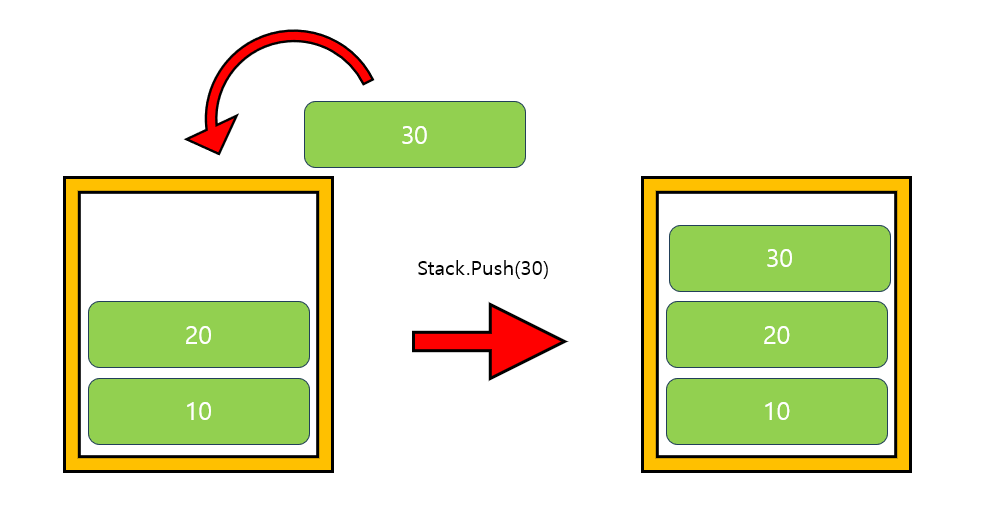
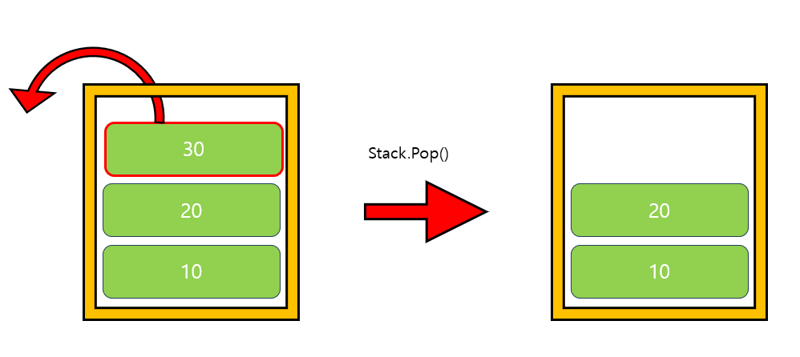

---
layout: simple
title: "Stack"
---

## Stack

- Stack은 가장 마지막에 추가된 데이터를 가장 먼저 사용하게 되는
- 후입선출(LIFO)구조의 자료구조입니다.

---

### Push(data)

- Stack의 가장 뒤에 데이터를 추가합니다.

#### 

---

### Pop()

- Stack의 가장 뒤의 데이터를 제거합니다.

#### 

---

### Peek()

- Stack의 가장 뒤의 데이터를 반환합니다.

---

### Contains(data)

- 매개변수로 찾고자 하는 data가 Stack에 존재하는지 확인합니다.
