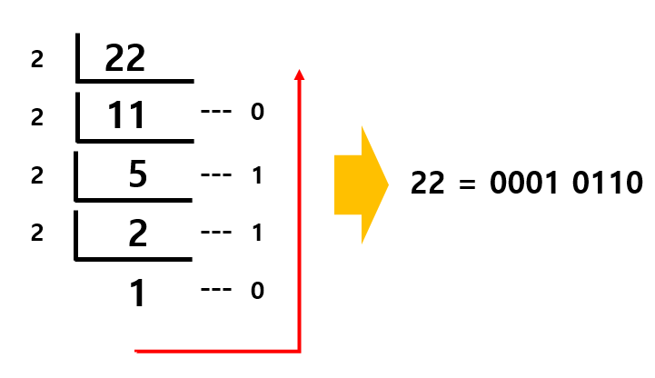

---
layout: simple
title: "비트"
---

## [데이터를 나타내는 최소 단위] ##

### 1. 0또는 1의 조합으로 논리 계산을 수행하는 단위입니다.

### 2. 메모리는 비트 단위로 데이터를 저장할 수 있으며, 1개의 비트에는 0 또는 1의 값만 저장할 수 있습니다. 

## "10진수를 2진수로 변환하는 과정" ## 
####  ####
### 1. 10진수를 1이 될 때까지 계속 2로 나누어 줍니다.
### 2. 나머지 값을 아래에서 위로 순서대로 정렬합니다.

## "2진수를 10진수로 변환하는 과정" ## 
####  ####
### 1. 1byte에 2진수로 저장된 값을 2의 제곱으로 나타냅니다.
### 2. 각각의 비트를 모두 더하여 10진수로 나타냅니다.
   

## "비트 연산자" ##
### 비트 단위로 논리 연산을 수행하기 위해 사용하는 연산자입니다.
ex) int a = 15;   =>   `0000 1111`  
ex) int b = 10;   =>   `0000 1010`  

1. **AND 연산자**
####  ####
- 비교하는 두 비트가 모두 1일 때 1을 반환

2. **OR 연산자**
####  ####
- 비교하는 두 비트 중 하나라도 1이면 1을 반환

3. **XOR 연산자**
####  ####
- 비교하는 두 비트가 같으면 0을 다르면 1을 반환

4. **NOT 연산자**
####  ####
   - 0인 비트는 1로 1인 비트는 0으로 반전
   - 첫 번째 비트는 부호를 나타내며, 첫 번째 비트에 1이 있다면 값은 음수가 됩니다.

## "시프트 연산자" ##
### 0과 1로 이루어진 2진수를 왼쪽 또는 오른쪽으로 원하는 자리만큼 이동하는 연산자입니다.
ex) int money=10;    =>  `0000 1010`

1. **" << "**
   - money << 2   => `0010 1000`

2. **" >> "**
   - money >>2    =>  `0000 0010`

