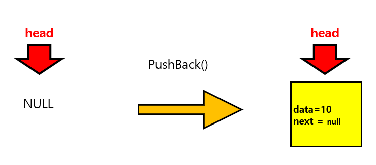
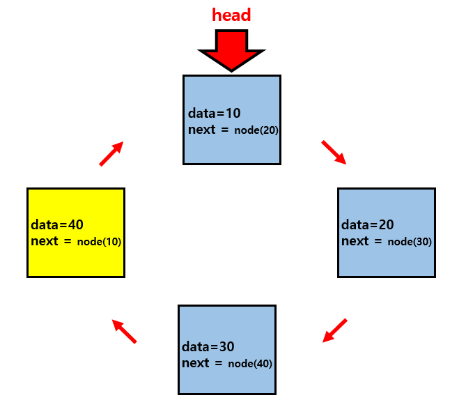
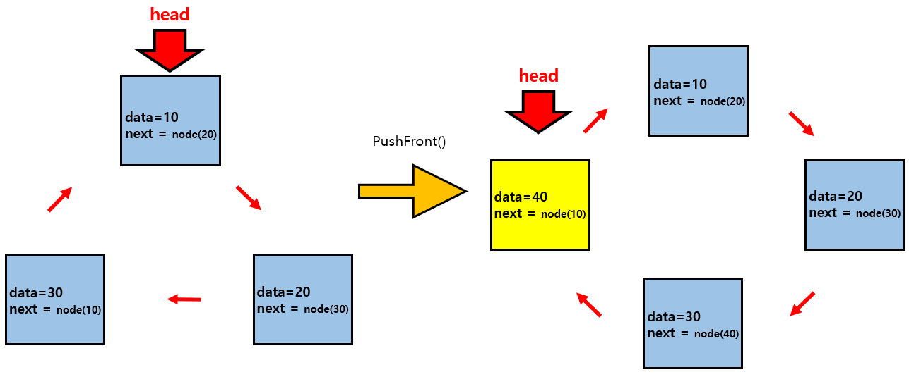
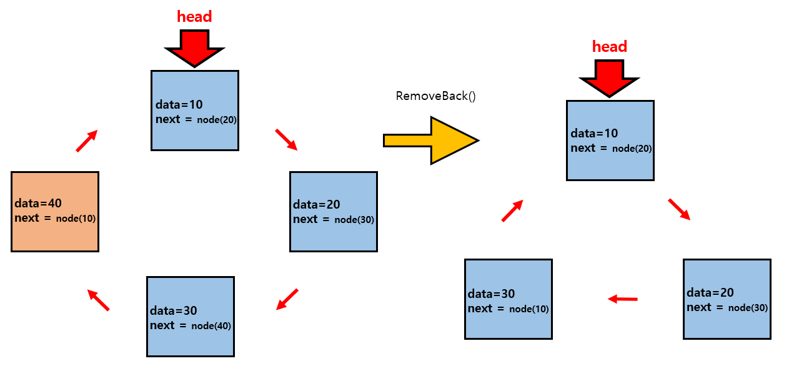
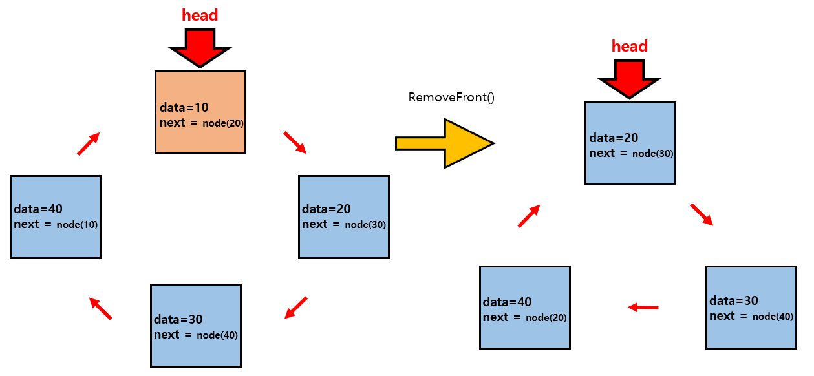

## CircleLinkedList

- 각 노드가 다음 노드에 대한 참조를 가지는 데이터 구조입니다.
- head는 리스트의 가장 앞의 노드를 가리키는 참조변수입니다.

### Node

- 제네릭타입을 이용해서 컴파일 시 타입 안전성을 보장합니다.

---

### PushBack(data)

- 만약 현재 리스트가 NULL이라면 새로운 노드를 추가하고 head에 할당합니다.

#### 

- 리스트의 가장 마지막에 새로운 데이터를 가지는 노드를 추가합니다.
- 현재 리스트의 마지막 노드의 next에는 새로운 노드를 할당합니다.
- 새로운 노드의 next에 head를 할당해줍니다.

#### 

---

### PushFront(data)

- 만약 현재 리스트가 NULL이라면 새로운 노드를 추가하고 head에 할당합니다.
- 리스트의 가장 앞에 새로운 데이터를 가지는 노드를 추가합니다.
- head 노드를 새로 추가하는 노드로 갱신해줍니다.

#### 

---

### RemoveBack()

- 리스트의 개수가 1개 이상이여야 합니다.
- 리스트의 가장 마지막 노드를 삭제합니다.
- 삭제된 이후 리스트의 마지막 노드의 next에 head node를 할당해줍니다.
- 만약 현재 리스트에 노드가 하나뿐이라면 head를 null로 초기화해줍니다.

#### 

---

### RemoveFront()

- 리스트의 개수가 1개 이상이여야 합니다.
- 리스트의 가장 앞에 노드를 삭제합니다.
- head 노드를 삭제되는 노드의 next노드로 갱신해줍니다.
- 마지막 노드의 next를 현재 head로 다시 할당해줍니다.

#### 
