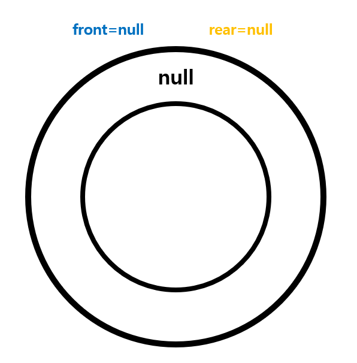
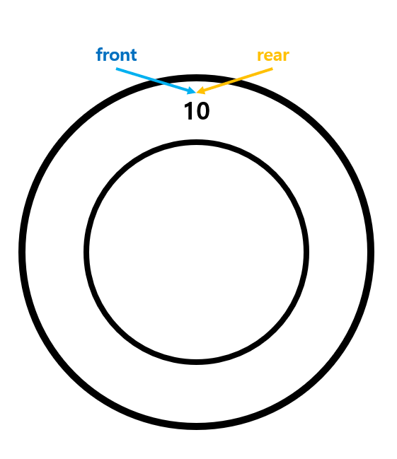
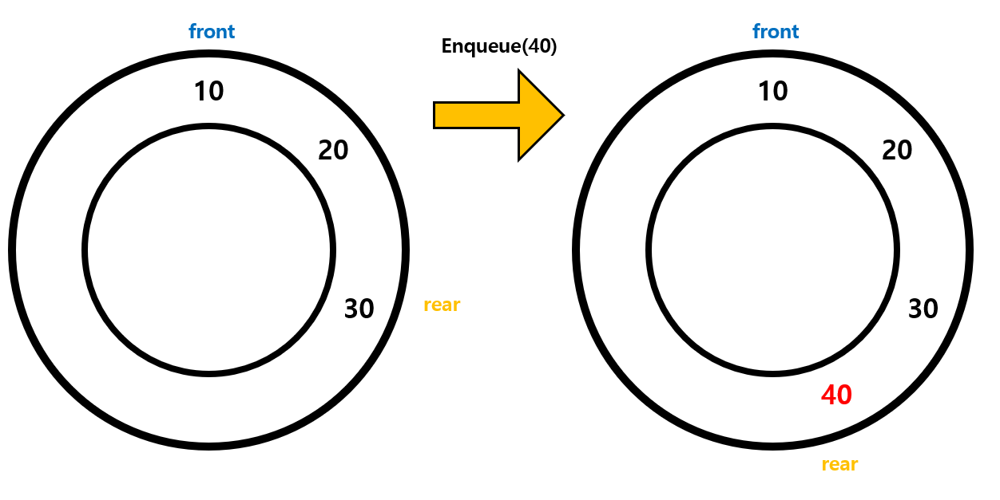

---
layout: simple
title: "LinearQueue"
---

## LinearQueue

- LinearQueue는 가장 먼저 추가된 데이터를 가장 먼저 사용하는
- 선입선출(FIFO)구조의 자료구조입니다.
- 큐의 첫번째 요소를 가리키는 front와 큐의 마지막 요소를 가리키는 rear를 이용해서
- 삽입(**Enqueue**)과 삭제(**Dequeue**)를 수행합니다.

---

### Enqueue(data)

- 큐가 null이라면 front와 rear는 모두 null입니다.

#### 

- 큐의 길이가 1이라면 front와 rear는 같은 값을 가리킵니다.

#### 

- 큐의 길이가 1이상일 때, front는 가장 처음 추가된 데이터를 가리킵니다.
- rear는 새로 추가될 데이터로 재할당합니다.

#### 

---

### Dequeue()

- 큐의 길이가 1이상일때만 실행할 수 있습니다.
- 큐의 길이는 1이라면 front와 rear는 모두 null을 할당합니다.
- front의 데이터를 삭제하고 front 다음 데이터에 front를 다시 할당합니다.

#### 

---

### 원형큐(Circular Queue)의 장점

- 원형 큐는 선형 큐와 달리 큐의 앞부분에서 제거된 요소의 공간을 다시 사용할 수 있기 때문에 메모리 사용이 효율적입니다.
- 큐의 시작과 끝이 연결되어 있어 데이터 관리가 용이합니다.
