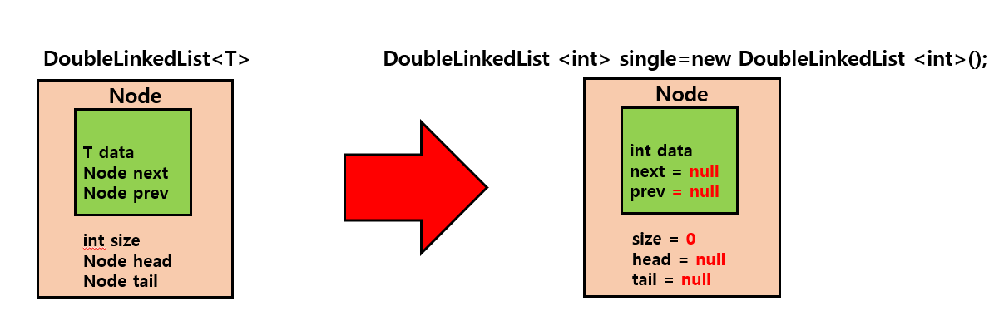
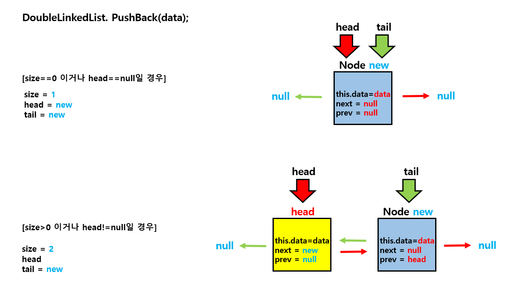
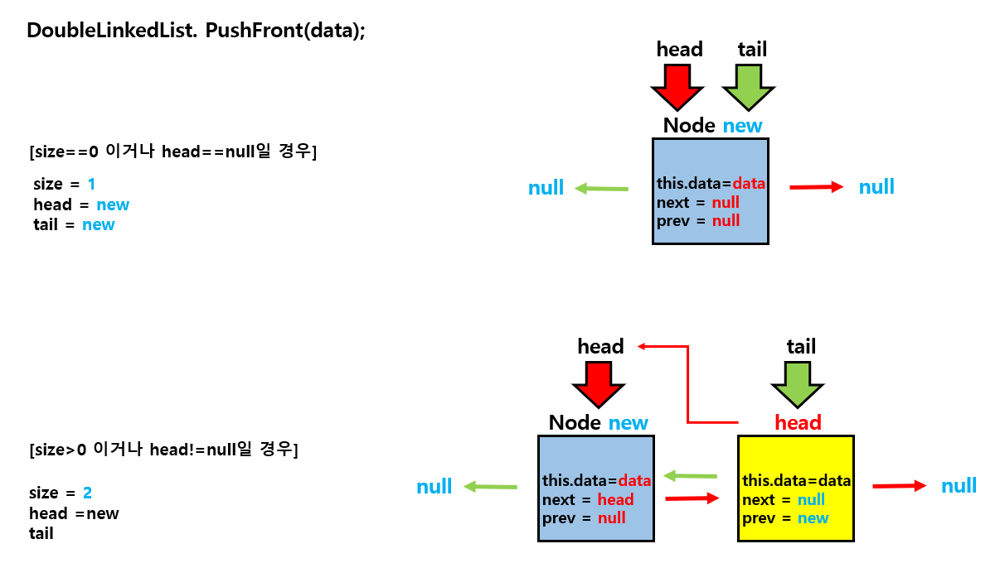
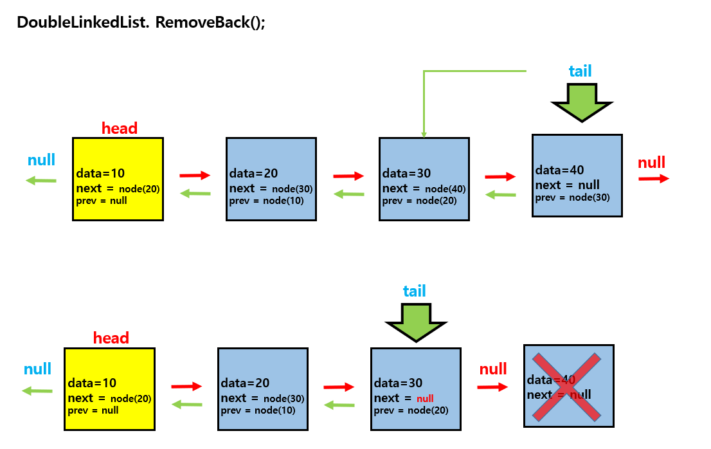
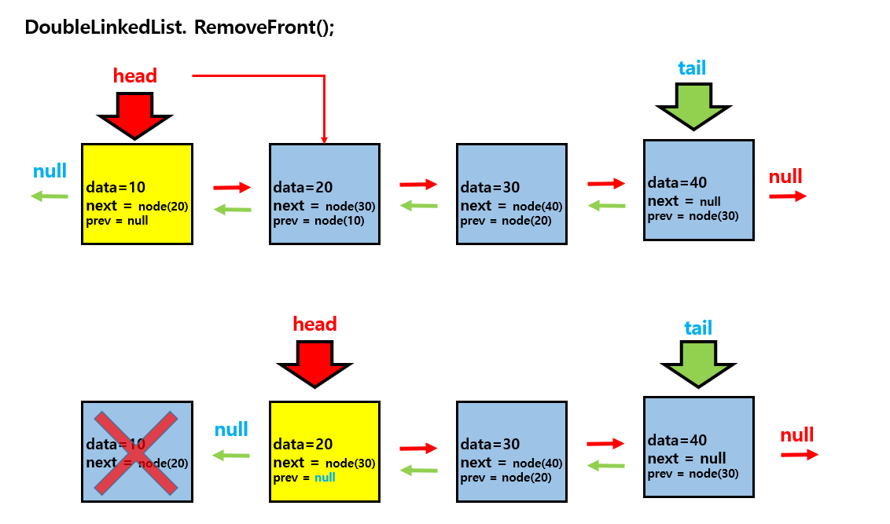

---
layout: simple
title: "Animation"
---

## DoubleLinkedList

- 각 노드가 이전 노드와 다음 노드에 대한 참조를 모두 가지는 데이터 구조입니다.
- head는 리스트의 가장 앞의 노드를 가리키는 참조변수입니다.
- tail은 리스트의 가장 마지막 노드를 가리키는 참조변수입니다.
- next는 현재 노드의 다음 노드를 가리키는 참조변수입니다.
- prev는 현재 노드의 이전 노드를 가리키는 참조변수입니다.

### Node

- 제네릭타입을 이용해서 컴파일 시 타입 안전성을 보장합니다.

#### 

---

### PushBack(data)

- 리스트의 가장 마지막에 새로운 데이터를 가지는 노드를 추가합니다.
- tail 노드를 새로 추가하는 노드로 갱신해줍니다.

#### 

---

### PushFront(data)

- 리스트의 가장 앞에 새로운 데이터를 가지는 노드를 추가합니다.
- head 노드를 새로 추가하는 노드로 갱신해줍니다.

#### 

---

### RemoveBack()

- 리스트의 가장 마지막 노드를 삭제합니다.
- tail 노드를 삭제되는 노드의 prev노드로 갱신해줍니다.

#### 

---

### RemoveFront()

- 리스트의 가장 앞에 노드를 삭제합니다.
- head 노드를 삭제되는 노드의 next노드로 갱신해줍니다.

#### 

### Show()

- 최초 head를 가리키는 curNode를 선언하여 리스트의 끝까지 출력합니다.

```csharp
 if (head != null)
 {
     Node curNode = head;
     while (true)
     {
         Console.WriteLine(curNode.data);
         curNode = curNode.next;

         if (curNode == null)
             break;
     }
 }
```
