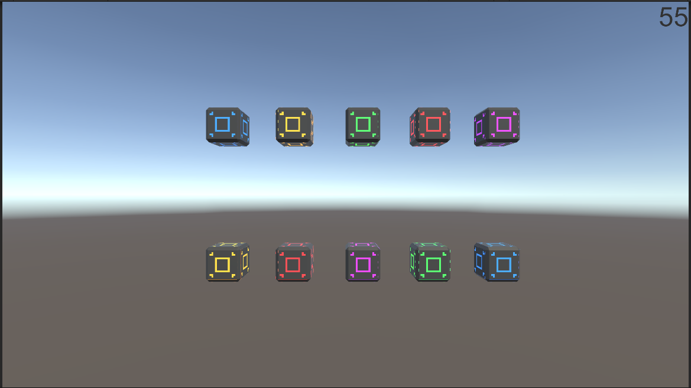
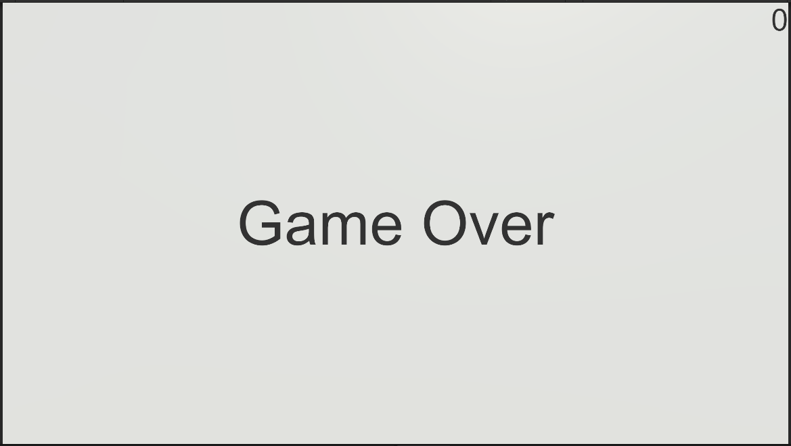

---
layout: simple
title: "TEST"
---

## TEST

- 약식 사천성 구조를 구현합니다.
- 만약 서로 다른 색의 큐브를 연결하려고 하면 연결되지 않게 합니다.
- 서로 같은 색의 큐브끼리 연결되게 합니다.
- 같은 색의 큐브가 연결되면 해당 쌍의 큐브를 사라지게 합니다.
- 만약 시간초 내에 모든 큐브를 연결하지 못하면 Game Over가 됩니다.

---

### 큐브 배치

#### 

- 각 큐브는 무작위의 순서로 각 줄에 배치됩니다.
- 한 줄에 중복되게는 배치되지 않습니다.

### 큐브 구조

- 각 큐브는 **Click**이란 interface를 모두 상속받아 각자 Interact()동작을 구현합니다.

#### Click.cs

```csharp
public interface Click
{
    public void Interact();
}
```

## 오류 발생

#### 각 쌍의 큐브가 클릭될 경우에 정상적으로 사라지게 구현되었으나, 한 큐브를 두 번 클릭할 경우에 큐브가 사라지는 오류가 발생하였습니다.

- 큐브에 **bool clicked**를 이용해서 현재 클릭된 큐브가 두번 클릭되어 사라지지 않게 오류를 방지합니다.
- **CubeManager.cs**에서 CurClickedCube와 PrevClickedCube를 이용해서 쌍을 잘 못 찾았을 경우에 다시 각 큐브의 clicked를 초기화 시켜주면서 또다른 오류를 방지해줍니다.

### TEST 개요

- 설정된 시간이 Time.deltaTime에 의해 줄어듭니다.
- 제한 시간내에 모든 큐브 쌍을 파괴하지 못할 경우, GameOver문구가 나오게 됩니다.

#### \

- 제한 시간내에 모든 큐브 쌍을 파괴하게 되면, 성공문구와 함께 제한시간이 정지하게 됩니다.

#### 
